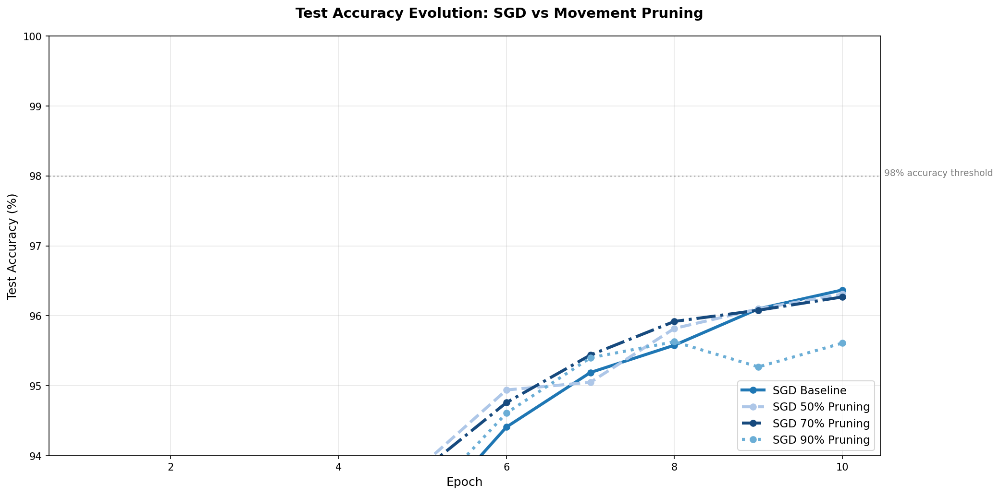
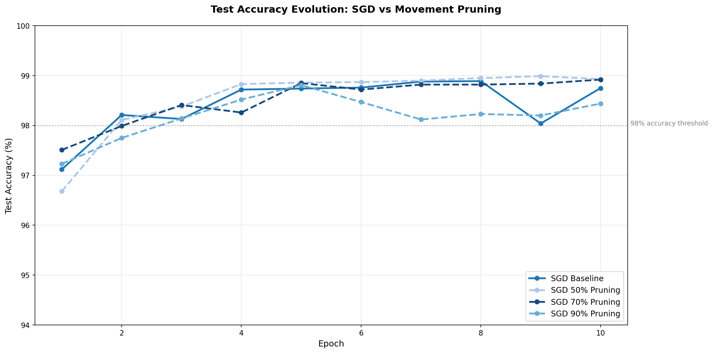
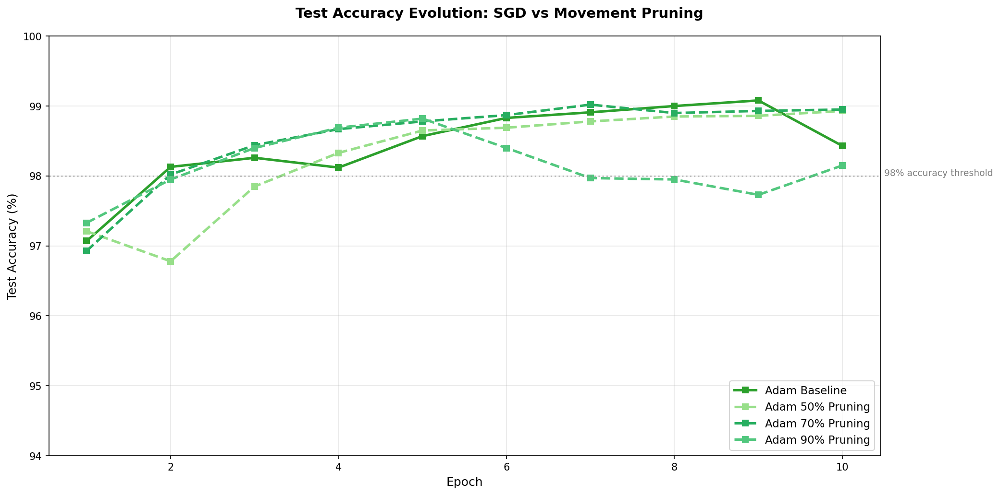
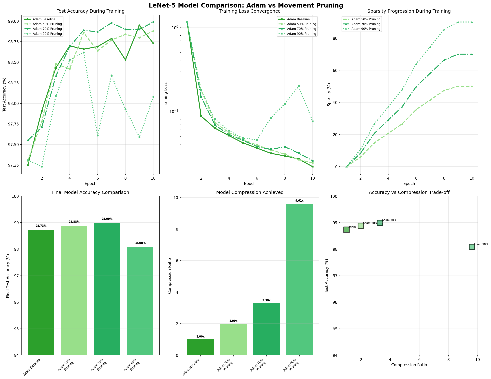
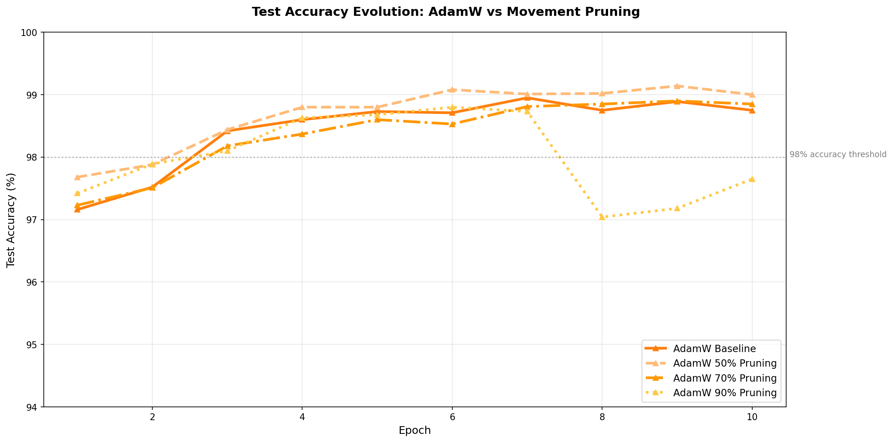
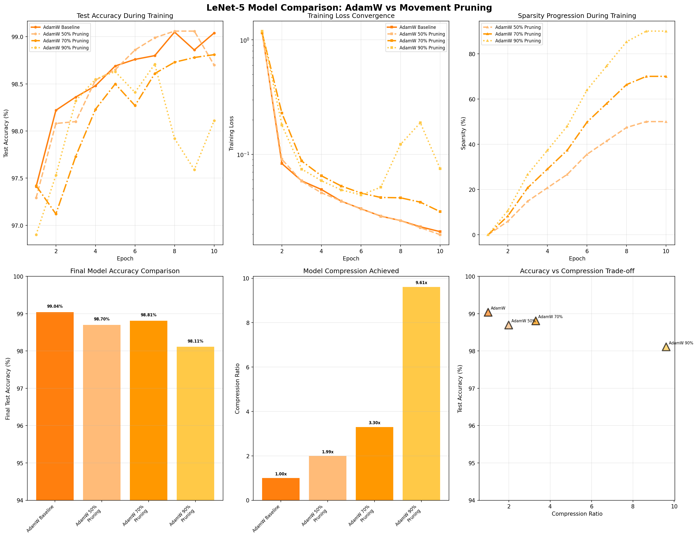
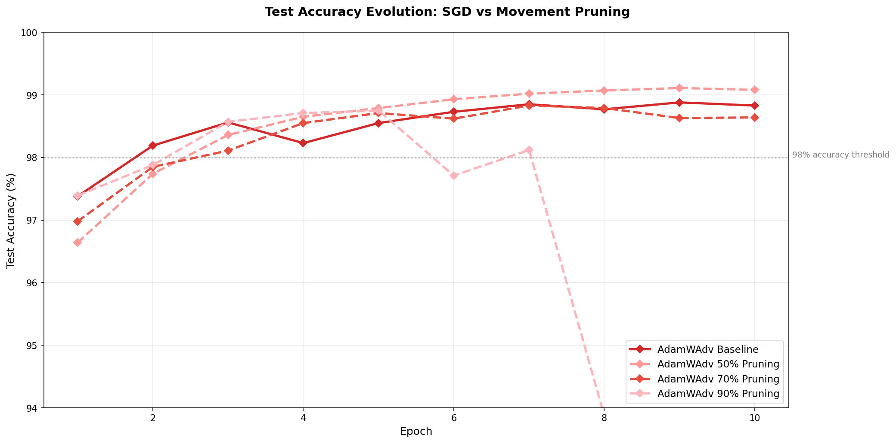
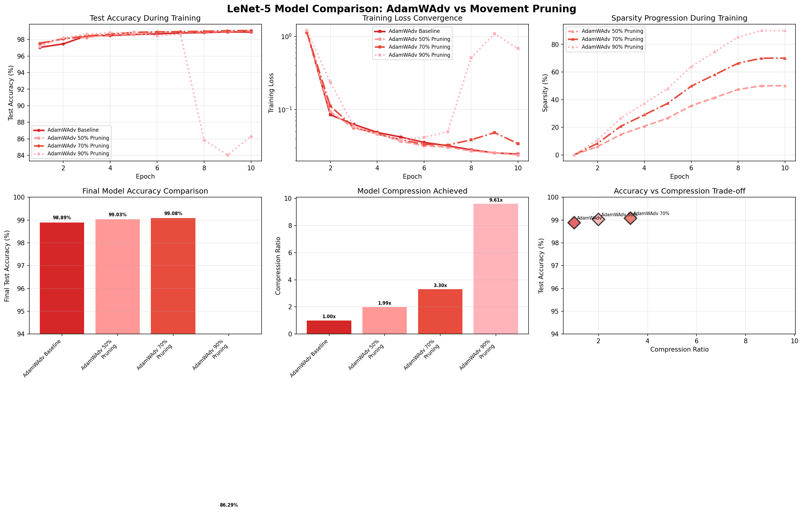

# LeNet-5 with Movement Pruning

This repository implements LeNet-5 for MNIST digit classification with support
for movement pruning, an adaptive sparsity technique for model compression.
It starts off with a basic implementation inspired by Digital Ocean's
["Writing Lenet-5 From Scrach in Python"](https://www.digitalocean.com/community/tutorials/writing-lenet5-from-scratch-in-python)
as a source, and then enhance it for performance and adds some more R&D
topics.

## Features

- **LeNet-5 Architecture**: Classic CNN for digit recognition, with an Adam optimizer
- **GPU Optimization**: Optimized to run on GPUs
- **Movement Pruning**: Adaptive sparsity based on weight movements during training
- **Logging**: Detailed training metrics and visualization support
- **A/B/C/D Testing**: Compare multiple pruning configurations with visualization

## Movement Pruning

Movement pruning is implemented based on the paper ["Movement Pruning: Adaptive Sparsity by Fine-Tuning"](https://arxiv.org/abs/2005.07683) by Sanh et al. (2020). This technique achieves model compression by learning which weights to prune during training based on their movement patterns.

### How It Works

1. **Movement Scoring**: For each weight, compute the movement score: `S_i = W_i * (W_i - W_i^0)`
   - Positive scores indicate weights moving away from zero (kept)
   - Negative scores indicate weights moving towards zero (pruned)

2. **Adaptive Sparsity**: Gradually increases sparsity from 0% to target level during training

3. **Global Magnitude Pruning**: Uses a global threshold across all layers for balanced compression

## AdamW Advanced (AdamWAdv)

AdamWAdv is an enhanced version of the AdamW optimizer that includes all recommended optimizations for improved training stability and convergence. This configuration combines multiple techniques that have been shown to improve neural network training:

### Features and References

1. **AMSGrad**: Ensures convergence by maintaining the maximum of exponential moving average of squared gradients
   - Reference: ["On the Convergence of Adam and Beyond"](https://arxiv.org/abs/1904.09237) (Reddi et al., 2018)

2. **Cosine Annealing Learning Rate Schedule**: Smoothly reduces learning rate following a cosine curve
   - Reference: ["SGDR: Stochastic Gradient Descent with Warm Restarts"](https://arxiv.org/abs/1608.03983) (Loshchilov & Hutter, 2017)

3. **Gradient Clipping**: Prevents gradient explosions by limiting the norm of gradients
   - Reference: ["On the difficulty of training recurrent neural networks"](https://arxiv.org/abs/1211.5063) (Pascanu et al., 2013)

4. **Decoupled Weight Decay**: AdamW's core feature that decouples weight decay from gradient-based optimization
   - Reference: ["Decoupled Weight Decay Regularization"](https://arxiv.org/abs/1711.05101) (Loshchilov & Hutter, 2019)

5. **Tuned Hyperparameters**:
   - Weight decay = 0.01 for stronger regularization
   - β₁ = 0.9, β₂ = 0.999 (standard values)
   - ε = 1e-8 for numerical stability

### Usage

```bash
# Train with AdamW Advanced optimizer
python train.py --optimizer adamwadv

# Combine with movement pruning
python train.py --optimizer adamwadv --pruning-method movement --target-sparsity 0.9
```

## Install dependencies

```bash
pip install torch torchvision numpy matplotlib logging json
```

## Usage

### Reproduce findings and graph results

```bash
make sgd-movement
```

You should see something like this in less than 5 minutes, we've trimmed
the results to only show the relevant stats here:

```
Model                     Accuracy     Compression  Parameters      Training Time
--------------------------------------------------------------------------------
SGD Baseline              96.24       % 1.00        x 61,750/61,750   16.39       s
SGD 50% Pruning           97.02       % 1.99        x 31,015/61,750   16.28       s
SGD 70% Pruning           96.16       % 3.30        x 18,721/61,750   16.18       s
SGD 90% Pruning           95.31       % 9.61        x 6,427/61,750    16.12       s
Adam Baseline             98.43       % 1.00        x 61,750/61,750   16.96       s
Adam 50% Pruning          98.93       % 1.99        x 31,015/61,750   16.66       s
Adam 70% Pruning          98.95       % 3.30        x 18,721/61,750   16.29       s
Adam 90% Pruning          98.15       % 9.61        x 6,427/61,750    16.61       s
AdamW Baseline            98.84       % 1.00        x 61,750/61,750   16.31       s
AdamW 50% Pruning         98.85       % 1.99        x 31,015/61,750   16.32       s
AdamW 70% Pruning         98.99       % 3.30        x 18,721/61,750   16.46       s
AdamW 90% Pruning         97.97       % 9.61        x 6,427/61,750    16.45       s
AdamWAdv Baseline         98.83       % 1.00        x 61,750/61,750   17.25       s
AdamWAdv 50% Pruning      99.08       % 1.99        x 31,015/61,750   16.43       s
AdamWAdv 70% Pruning      98.64       % 3.30        x 18,721/61,750   16.79       s
AdamWAdv 90% Pruning      87.80       % 9.61        x 6,427/61,750    16.76       s
================================================================================

================================================================================

```

To run all tests, use:

```bash
make
```

### Basic Training (No Pruning)

```bash
python train.py
```

### Training with Movement Pruning

```bash
# Train with 90% sparsity (default)
python train.py --pruning-method movement

# Train with custom sparsity level (50%)
python train.py --pruning-method movement --target-sparsity 0.5

# Adjust warmup steps before pruning begins
python train.py --pruning-method movement --target-sparsity 0.7 --pruning-warmup 200
```

### Command-Line Arguments

- `--optimizer`: Optimizer to use, by default we use "SGD", other options are "adam", "adamw", "adamwadv"
- `--pruning-method`: Pruning method to use (`none` or `movement`, default: `none`)
- `--target-sparsity`: Target sparsity level 0.0-1.0 (default: `0.9`)
- `--pruning-warmup`: Number of training steps before pruning starts (default: `100`)

## Performance Results

### Model Comparison

## SGD

*Comparison of all model configurations*


*Test accuracy evolution across epochs for different pruning levels*

## Adam


*Comparison of all model configurations*


*Test accuracy evolution across epochs for different pruning levels*

## AdamW


*Comparison of all model configurations*


*Test accuracy evolution across epochs for different pruning levels*

## AdamWAdv


*Comparison of all model configurations*


*Test accuracy evolution across epochs for different pruning levels*

## Visualization

### Generate Comparison Plots

To generate comprehensive model comparison plots:

```bash
python plot_comparison.py
```

This creates:
- `model_comparison.png`: 6-panel comprehensive comparison including accuracy, loss, sparsity progression, final accuracy bars, compression ratios, and accuracy vs compression trade-off
- `accuracy_evolution.png`: Detailed accuracy evolution across training epochs

### Generate Individual Training Plots

To visualize individual training metrics:

```bash
python plot_training.py
```

This generates `training_plot.png` showing loss and accuracy curves over epochs.

## Technical Details

### Supported Layers
- Convolutional layers (Conv2d)
- Fully connected layers (Linear)

### Pruning Schedule
- **Warmup Phase**: No pruning for initial steps (configurable)
- **Ramping Phase**: Linear increase from 0% to target sparsity
- **Final Phase**: Maintain target sparsity level

### Implementation Files
- `train.py`: Main training script with pruning integration
- `movement_pruning.py`: Movement pruning implementation
- `plot_training.py`: Visualization utilities

## Hardware Requirements

- **GPU**: Any GPU with at least ~ 10 MiB of Memory
- **Memory**: Sufficient RAM for dataset loading
- **Storage**: ~200MB for MNIST dataset

## License

This implementation is provided for educational and research purposes.
