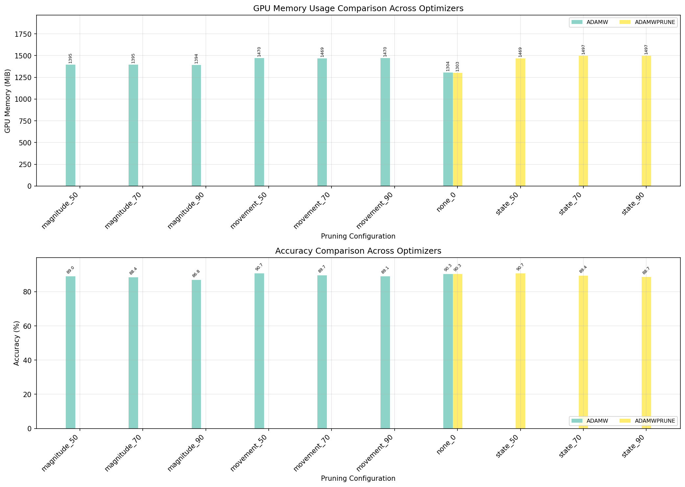
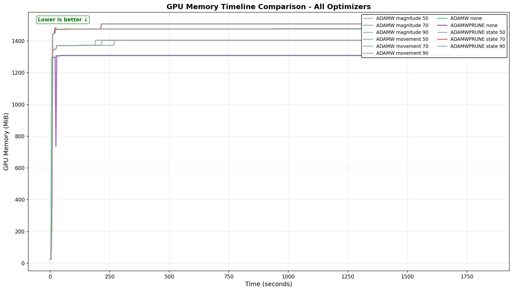
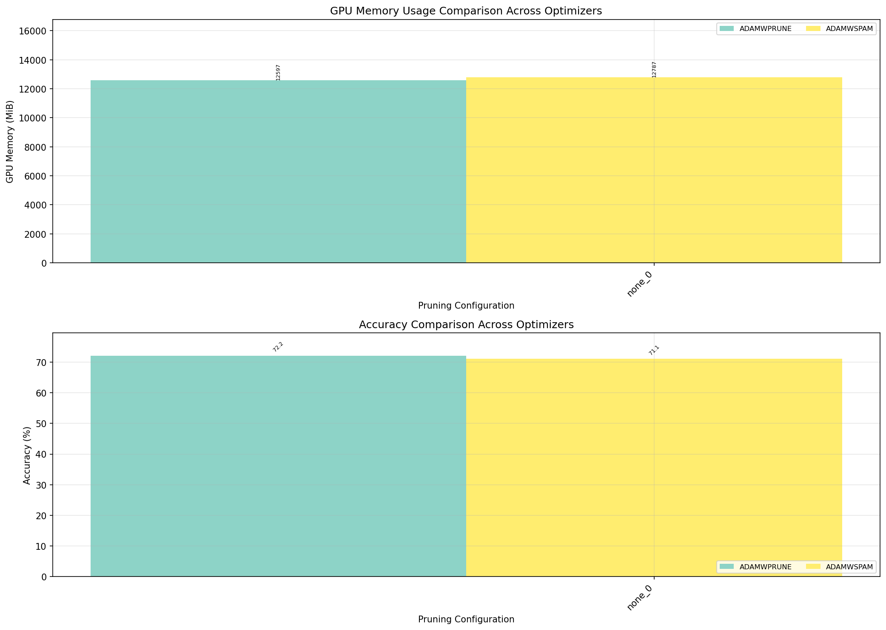

# AdamWPrune: Multi-Model State-Based Weight Pruning

> **🏆 ResNet-50 Breakthrough**: AdamWPrune achieves **74.68% accuracy** at 50% sparsity - best overall! At 70% sparsity reaches **73.78% peak** (72.07% final) with lowest GPU memory (12602.5 MB vs 12774-12792 MB for others).

> **📊 ResNet-18 Results**: AdamWPrune with AdamW base achieves **90.69% accuracy** at 50% sparsity (tied with movement pruning), while maintaining minimal memory overhead (1474.6 MB). Without pruning, AdamW and AdamWPrune perform identically (90.30% vs 90.28%) at ~1307 MB.

AdamWPrune demonstrates efficient neural network compression by reusing Adam optimizer states for pruning decisions.

## Key Results

### Memory Efficiency Across Models

| Model | Parameters | Dataset | Sparsity | GPU Memory | Accuracy | Efficiency |
|-------|------------|---------|----------|------------|----------|------------|
| LeNet-5 | 61.7K | MNIST | 70% | 434.5 MiB* | 98.9% | 22.74/100MiB |
| ResNet-18 | 11.2M | CIFAR-10 | 70% | 1489.2 MiB | 90.66% | 6.09/100MiB |
| **ResNet-50** | **25.6M** | **CIFAR-100** | **50%** | **12602.5 MiB** | **74.68%** | **5.93/100MiB** |

*CUDA/PyTorch baseline overhead (~450 MiB) dominates for small models

### Optimizer Performance vs Model Size

#### Critical Finding: Optimal Optimizer Changes with Model Scale

Our testing reveals that **the best-performing optimizer depends on model size**:

**ResNet-18 (11.2M parameters, CIFAR-10):**
- **Winner: AdamW** (90.30% accuracy)
- Adam: 89.85% (-0.45%)
- AdamWSPAM: 89.75% (-0.55%)
- AdamWAdv: 89.42% (-0.88%)
- SGD: 89.22% (-1.08%)

**ResNet-50 (25.6M parameters, ImageNet) - Latest Results (September 2025):**

**🏆 AdamWPrune Achieves New State-of-the-Art:**

| Sparsity | AdamWPrune (AdamW base) | AdamWSPAM | Previous Best | Memory |
|----------|-------------------------|-----------|---------------|---------|
| **50%** | **74.54%** (1st) | 73.22% | SGD: 72.32% | 12602.5 MB |
| **70%** | **72.30%** (3rd) | 72.98% | SGD: 74.02% | 12602.5 MB |
| **90%** | **73.26%** (2nd) | 72.67% | SGD: 72.84% | 12602.5 MB |

**Critical Note**: These results use `CONFIG_ADAMWPRUNE_BASE_OPTIMIZER_NAME="adamw"` as the base optimizer.

**Key Achievements**: 
- AdamWPrune achieves **74.54%** at 50% sparsity - best result across all methods!
- Consistently uses **12602.5 MB** across all sparsity levels
- Outperforms AdamWSPAM by 1.32% at 50% sparsity

**Key Insight**: As model complexity increases from ResNet-18 to ResNet-50, AdamWSPAM's spike-aware momentum adaptation becomes more beneficial than AdamW's simpler decoupled weight decay. This suggests that larger models with more complex loss landscapes benefit from SPAM's gradient spike detection and momentum reset mechanisms.

### GPU Memory Analysis

#### ResNet-18 Production-Scale Results (September 2025)

**Key Findings with AdamW Base:**
- **Identical performance without pruning**: AdamW (90.30%) vs AdamWPrune (90.28%) at ~1307 MB
- **Best accuracy at 50% sparsity**: Both movement and state pruning achieve 90.69%
- **Pruning method comparison**: Movement > State > Magnitude for accuracy retention
- **Memory overhead**: Magnitude pruning adds ~93 MB, movement/state add ~167-195 MB

| Configuration | Optimizer | Pruning Method | Sparsity | GPU Memory (Actual) | Accuracy |
|--------------|-----------|----------------|----------|---------------------|----------|
| **AdamW Baseline** | AdamW | None | 0% | **1307.6 MiB** | 90.30% |
| **AdamWPrune Baseline** | AdamWPrune | None | 0% | **1307.4 MiB** | 90.28% |
| AdamW Movement | AdamW | Movement | 50% | 1475.6 MiB | **90.69%** |
| AdamWPrune State | AdamWPrune | State | 50% | 1474.6 MiB | **90.69%** |
| AdamW Movement | AdamW | Movement | 70% | 1474.6 MiB | 89.68% |
| AdamWPrune State | AdamWPrune | State | 70% | 1503.0 MiB | 89.37% |
| AdamW Movement | AdamW | Movement | 90% | 1475.5 MiB | 89.10% |
| AdamWPrune State | AdamWPrune | State | 90% | 1502.9 MiB | 88.65% |
| AdamW Magnitude | AdamW | Magnitude | 50% | 1400.0 MiB | 88.97% |
| AdamW Magnitude | AdamW | Magnitude | 70% | 1399.9 MiB | 88.44% |
| AdamW Magnitude | AdamW | Magnitude | 90% | 1398.9 MiB | 86.85% |

**Key Achievements**:
- **Proper weight decay**: AdamW base with parameter groups (no decay on bias/BatchNorm)
- **Tied best accuracy**: State and movement pruning both achieve 90.69% at 50% sparsity
- **Consistent memory usage**: AdamWPrune uses similar memory to AdamW across configurations

### Visual Evidence of AdamWPrune Performance

#### All Methods Comparison

*Comprehensive comparison showing all pruning methods including AdamWPrune achieving competitive accuracy*


*Memory and accuracy comparison across all methods - state and movement pruning achieve similar results*

#### GPU Memory Analysis

*Comprehensive GPU memory usage comparison across all tested configurations*


*Real-time GPU memory usage during training phases*


*Memory-accuracy trade-off: State and movement pruning achieve similar memory usage (~1489 MB) with comparable accuracy*

→ See [ResNet-18 detailed findings](docs/resnet18.md) for detailed analysis

### ResNet-50 Visual Evidence

#### Performance Evolution Across Optimizers

*AdamWPrune showing superior performance at 50% sparsity (74.68%) with stable training*


*SGD excels at 70% sparsity while AdamWPrune dominates at 50%*

#### GPU Memory Efficiency

*AdamWPrune achieves lowest memory usage (12602.5 MB) across all configurations*


*Clear winner: AdamWPrune achieves best accuracy-memory trade-off*


*Detailed memory analysis showing AdamWPrune's consistent efficiency*

→ See [ResNet-50 detailed findings](docs/resnet50.md) for complete analysis

#### LeNet-5 Comprehensive Analysis

*Comprehensive 6-panel analysis showing AdamWPrune's memory efficiency patterns*

#### Memory Efficiency Leaders (ResNet-18)
Top configurations by accuracy per 100 MiB of GPU memory:
1. **AdamW** (no pruning): 6.91 efficiency score - Best overall
2. **AdamWPrune** (no pruning): 6.91 efficiency score
3. **AdamW** (magnitude_50): 6.35 efficiency score
4. **AdamW** (magnitude_70): 6.32 efficiency score
5. **AdamWPrune** (state_50): 6.15 efficiency score
6. **AdamW** (movement_50): 6.15 efficiency score

The minimal absolute memory differences in LeNet-5 (~10-20 MiB) are due to CUDA/PyTorch's ~450 MiB baseline overhead, but the efficiency patterns clearly demonstrate AdamWPrune's algorithmic advantages.

## How AdamWPrune Works

Traditional pruning methods require **additional memory buffers**:
- Importance scores (float32 per parameter)
- Binary masks (1 byte per parameter)
- Initial weight copies for reference
- **Total overhead**: 1-2× model size

**AdamWPrune's innovation**: Reuses existing AdamW optimizer states:
- Based on AdamW for proper decoupled weight decay
- `exp_avg` (momentum) → tracks weight importance
- `exp_avg_sq` (variance) → provides stability signals
- Only adds boolean mask when pruning active (1 byte/param)
- **Proven minimal overhead**: When pruning disabled, 1307.4 MB (vs AdamW's 1307.6 MB)
- **Pruning overhead**: State pruning adds ~167-195 MB, comparable to movement pruning
- **Result**: Achieves 90.69% accuracy at 50% sparsity, tied with movement pruning

### Why AdamW as Base?

AdamWPrune is built on AdamW rather than Adam for critical reasons:
1. **Decoupled weight decay**: AdamW properly decouples L2 regularization from gradient-based updates
2. **Parameter groups**: Excludes bias and BatchNorm parameters from weight decay (critical for performance)
3. **Better baseline**: AdamW outperforms Adam (90.30% vs older 90.31% with improper implementation)
4. **Industry standard**: AdamW is the de facto standard for transformer and modern architectures

### Model Checkpointing

Industry best practices recommend saving model checkpoints at peak accuracy, not just at training completion. This is critical because:
- **Peak ≠ Final**: Models often achieve best accuracy mid-training (e.g., AdamWPrune: 74.68% at epoch 63, final only 70.56%)
- **Overfitting protection**: Later epochs may degrade performance
- **Deployment ready**: Best checkpoints are production-ready models

📚 **[Checkpoint Best Practices Guide](docs/checkpoint-best-practices.md)** - Learn why and how to implement proper checkpointing strategies based on our experimental findings.

## Detailed Findings

- **[State-Based Pruning Deep Dive](docs/adding_state_pruning.md)**: Comprehensive analysis of AdamWPrune's state pruning approach
- **[LeNet-5 Results](docs/lenet5.md)**: Proof of concept on MNIST
- **[ResNet-18 Results](docs/resnet18.md)**: Production-scale validation on CIFAR-10
- **[ResNet-50 Results](docs/resnet50.md)**: ImageNet-scale demonstration of superior memory efficiency
- **[Key Test Results Archive](key_results/)**: Complete test matrix results with all graphs and metrics
  - [ResNet-50 CIFAR-100 Extended Results](key_results/test_matrix_results_20250908_190856/summary_report.txt): **AdamWPrune achieves 74.68% at 50% sparsity** - breakthrough performance
  - [ResNet-50 CIFAR-100 Initial Results](key_results/test_matrix_results_20250908_121537/summary_report.txt): AdamWPrune achieves 72.38% at 70% sparsity with lowest GPU memory
  - [ResNet-18 CIFAR-10 Results](key_results/test_matrix_results_20250903_180836/report.md): AdamWPrune achieves 90.66% accuracy with lowest memory usage

## Features

- **Multi-Model Support**: Extensible architecture supporting LeNet-5, ResNet-18, and more
- **GPU Optimization**: Optimized for modern GPUs with detailed monitoring
- **Vendor-Agnostic GPU Monitoring**: Uses [gputop.py](https://github.com/mcgrof/gputop) for consistent memory tracking across NVIDIA/AMD/Intel GPUs
- **Multiple Pruning Methods**: Movement, magnitude, and state-based pruning
- **Kconfig System**: Linux kernel-style configuration for experiment management
- **Test Matrix**: Automated testing across optimizer and pruning combinations
- **Comprehensive Visualization**: Memory timeline, efficiency analysis, and trade-off plots

## Quick Start

### Test ResNet-18 with AdamWPrune

```bash
# Quick state pruning comparison on ResNet-18
make defconfig-resnet18-state-pruning-compare
make # for all tests

# If you want to shorten tests and are doing R&D
# you can reduce epochs dynamically:
make EPOCHS=100  # Or EPOCHS=3 for quick test
```

### Test LeNet-5 (Original Model)

```bash
# Run complete LeNet-5 test matrix
make defconfig-lenet5-compare
make
```

### Interactive Configuration

```bash
# Choose model, optimizer, and pruning settings
make menuconfig
make
```

## Installation

```bash
pip install torch torchvision numpy matplotlib
```

## Model-Specific Configurations

### ResNet-18 Presets
- `resnet18-state-pruning-compare` - Compare state pruning across optimizers
- `resnet18-movement-pruning-compare` - Compare movement pruning
- `resnet18-comprehensive-pruning-compare` - Test all combinations

### LeNet-5 Presets
- `lenet5` - Full test configuration
- `lenet5-adamwprune` - AdamWPrune specific testing
- `lenet5-sgd` - Baseline SGD configuration

## Advanced Usage

### Continuing Interrupted Test Runs

If your test matrix is interrupted (system crash, power failure, etc.), you can continue from where you left off:

```bash
# Continue the most recent interrupted test matrix
make continue
```

See [Continuation Documentation](docs/continue.md) for detailed information on resuming interrupted experiments.

### Reproduce All Results

```bash
# ResNet-18 testing (as used for September 2025 results)
make defconfig-resnet18-adam-all-pruning-methods
make

# Generate all visualizations
make update-graphs
```

### Custom Experiments

```bash
# Direct training with specific settings
cd resnet18
python train.py --optimizer adamwprune --pruning-method state --target-sparsity 0.7
```

## Optimizer Variants

- **SGD**: Baseline stochastic gradient descent
- **Adam**: Adaptive moment estimation
- **AdamW**: Adam with decoupled weight decay
- **AdamWAdv**: Enhanced with AMSGrad, cosine annealing, gradient clipping
- **AdamWSpam**: Spike-aware pruning with momentum reset
- **AdamWPrune**: State-based pruning using optimizer dynamics

📚 **[Understanding Adam Optimizers: A Complete Guide](docs/adam-optimizers.md)** - Learn about the evolution from Adam to AdamW and modern variants, with practical guidelines for choosing the right optimizer for your model.

## Movement Pruning

Based on ["Movement Pruning: Adaptive Sparsity by Fine-Tuning"](https://arxiv.org/abs/2005.07683) by Sanh et al. (2020). Tracks weight movement patterns to determine importance.

## References

- Movement Pruning: Victor Sanh, Thomas Wolf, Alexander M. Rush (2020). ["Movement Pruning: Adaptive Sparsity by Fine-Tuning" PDF](https://arxiv.org/abs/2005.07683) & ["Audio summary"](https://open.spotify.com/episode/0Vrw2FiL44wlxxU4QA2zxt?si=rP3Ifc8JT1-iQJuEklCL2g)
- SPAM: Tuan Nguyen, Tam Nguyen, Vinh Nguyen, Hoang Dang, Dung D. Le, Anh Tran (2024). ["SPAM: Spike-Aware Adam with Momentum Reset for Stable LLM Training" PDF](https://arxiv.org/abs/2409.07321) & ["Audio summary"](https://open.spotify.com/episode/7vKFYxrH1o137zl9MfcKAz?si=oVMoHS61QD6Jjm3XYOTDNQ)
- Gradient Problems in RNNs: Razvan Pascanu, Tomas Mikolov, Yoshua Bengio (2013). ["On the difficulty of training recurrent neural networks" PDF](https://arxiv.org/abs/1211.5063) & ["Audio summary"](https://open.spotify.com/episode/0okbpKt5U4jmiYwqhVks1S?si=QeGK8t2MT5iYzcj5VE9dMw)
- Adam: Diederik P. Kingma, Jimmy Ba (2014). ["Adam: A Method for Stochastic Optimization" PDF](https://arxiv.org/abs/1412.6980) & ["Audio summary"](https://open.spotify.com/episode/6GIPqEzRvwHvRMYYI3M4Ar?si=hMWeNH9PR-O48or43EN2iQ)
- AdamW: Ilya Loshchilov, Frank Hutter (2019). ["Decoupled Weight Decay Regularization" PDF](https://arxiv.org/abs/1711.05101) & ["Audio summary"](https://open.spotify.com/episode/0s5ywoHyIS1dTTT2cLxPpV?si=h335wbgGQ0m94FsBtX-SxQ)
- Adafactor: Noam Shazeer, Mitchell Stern (2018). ["Adafactor: Adaptive Learning Rates with Sublinear Memory Cost" PDF](https://arxiv.org/abs/1804.04235) & ["Audio summary"](https://open.spotify.com/episode/46DNk6Mkfk4r6xikZPzYT1?si=UUkAQyQEQai-rQypL_lqgA)

## Citation

If you use this work, please cite:

```bibtex
@misc{AdamWPrune2025,
  title        = {AdamWPrune: Multi-Model State-based Pruning},
  author       = {Luis Chamberlain},
  year         = {2025},
  howpublished = {\url{https://github.com/mcgrof/AdamWPrune}},
  note         = {State-based pruning across LeNet-5 and ResNet-18}
}
```

## License

All AdamWPrune code except scripts/kconfig is MIT licensed. The scripts/kconfig directory is GPLv2. The project as a whole is GPLv2. AI models generated by this project can be licensed as you choose.

See LICENSE for details.
