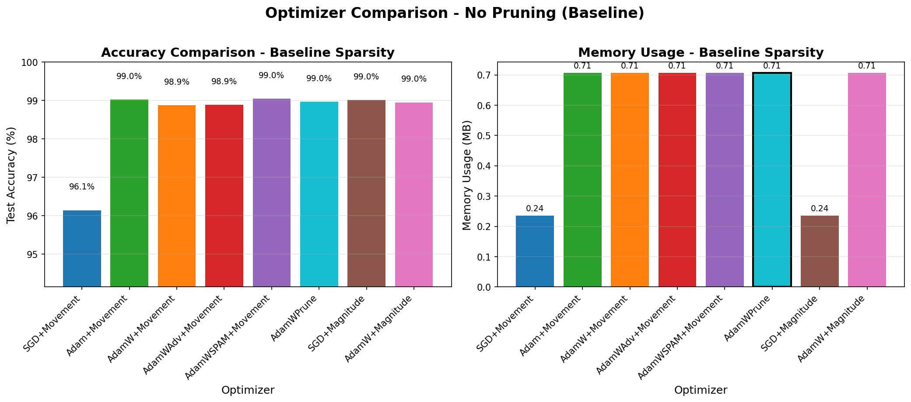
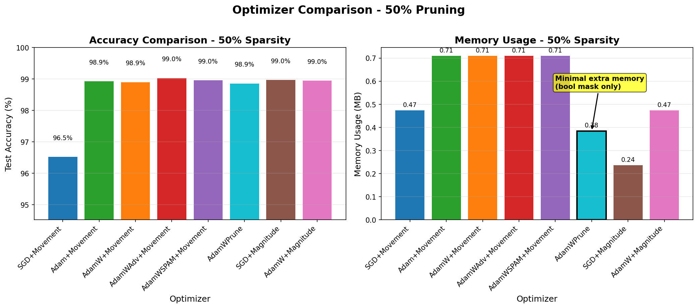
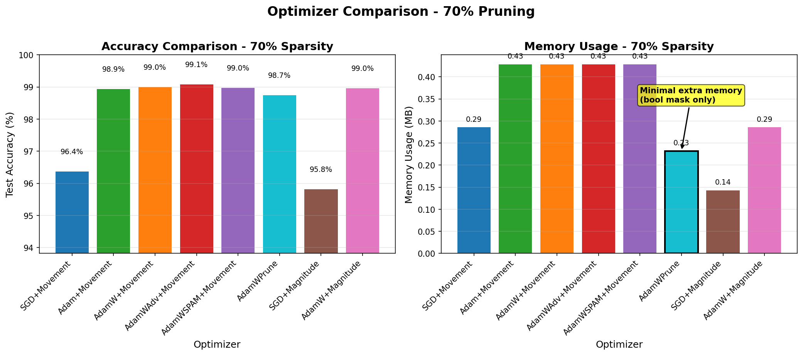
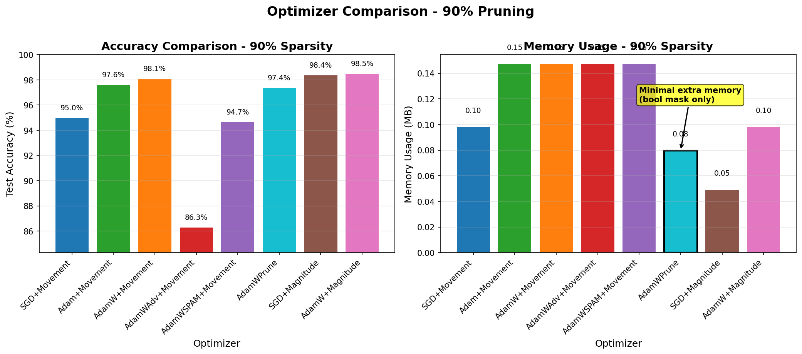
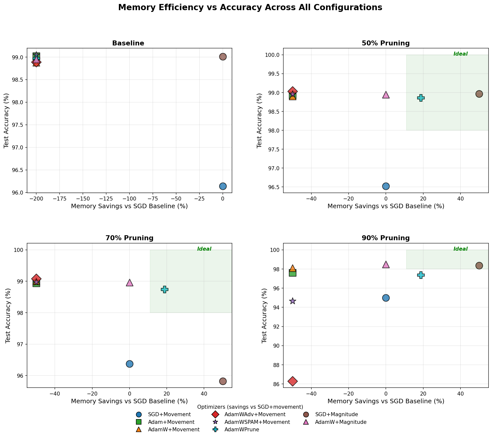
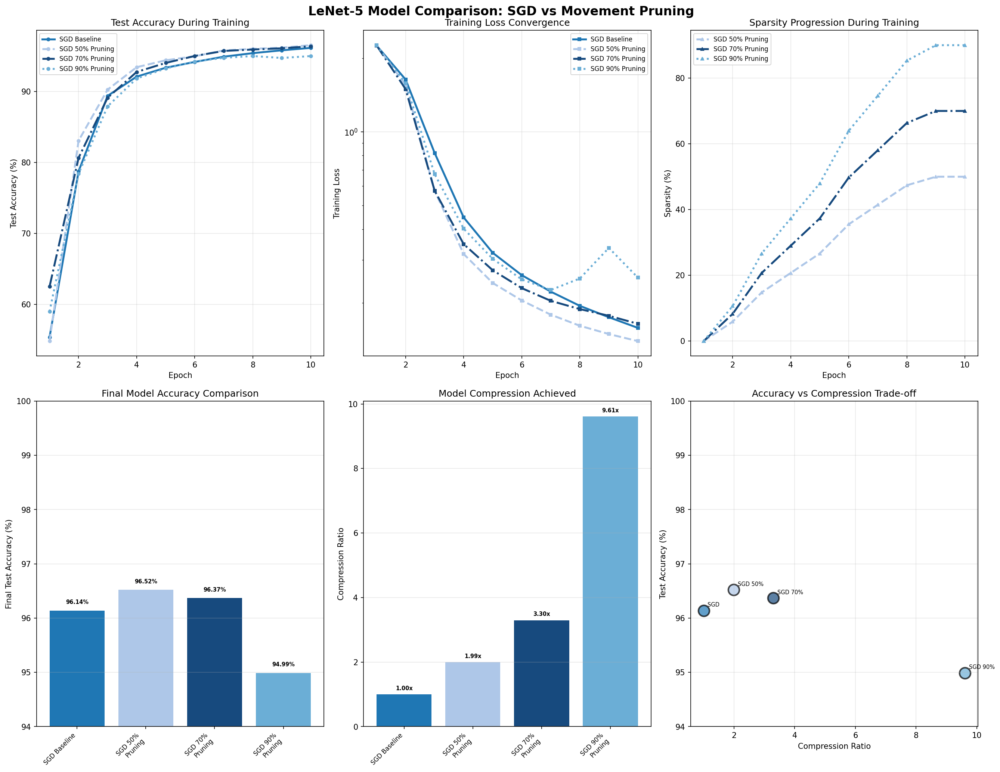
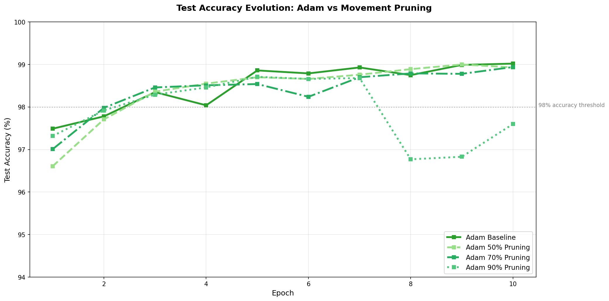
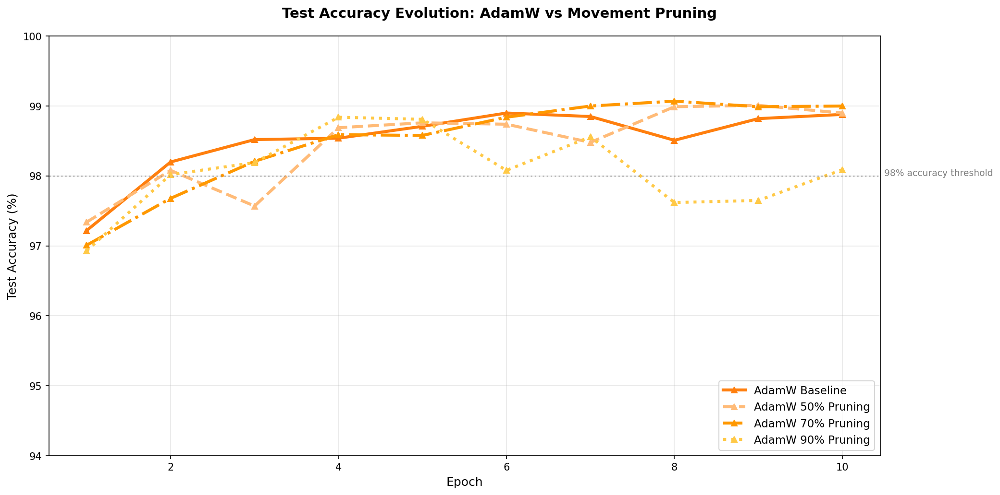
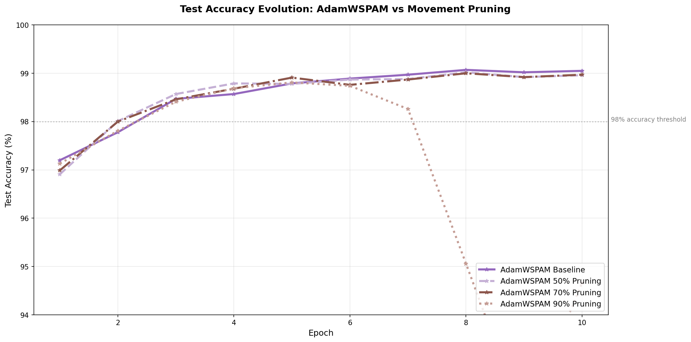
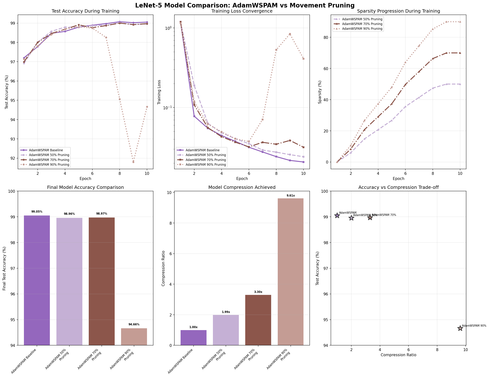

# AdamWPrune: LeNet-5 with Adam State Movement Pruning

This repository implements LeNet-5 for MNIST digit classification with support
for different adaptive weight pruning techniques, for model compression,
and introduces the prospect of implementing weight pruning by relying on
Adam states, we refer to this as AdamWPrune.

This project git history starts off with a modern
["basic implementation of Lenet-5 on Pytorch"](https://www.digitalocean.com/community/tutorials/writing-lenet5-from-scratch-in-python).
We then enhance it for performance and add support for different
optional Adam optimizer enhancements. We add support for different target
different sparsity target levels. The key focus for this effort was to evaluate
whether or not existing Adam optimizer states could be leveraged for weight
pruning, instead of relying on additional parameters which are typically
introduced for that purpose such as with movement pruning.

The results indicate that its possible to rely on Adam states for weight
pruning while maintaining accuracy. However since Lenet-5 is such as small
model, the next steps are to scale this effort onto a bigger model to
evaluate accurracy and memory savings impact.

## Memory Overhead: How to compute pruning overhead

Traditional movement pruning requires **extra memory** on top of optimizer states:
- **Importance scores**: 1 float per parameter to track weight importance
- **Binary masks**: 1 value per parameter to mark pruned/kept weights
- **Total overhead**: 1-2× model size in additional memory

**AdamWPrune's tactic**: Reuses Adam's existing states for pruning decisions:
- `exp_avg` (momentum) → tracks weight importance
- `exp_avg_sq` (variance) → provides stability signals
- Requires only a boolean mask when pruning is enabled (1 byte/param).

Example with 61,750 parameters (float32):
- Weights: ~247KB
- AdamW states: ~494KB (exp_avg + exp_avg_sq)
- Movement pruning buffers (this repo): ~741KB (scores + initial_weights + masks)
- AdamWPrune boolean mask: ~60KB

Totals when pruning at non-baseline levels:
- **AdamW + movement pruning**: ~247KB + 494KB + 741KB ≈ 1,482KB
- **AdamWPrune**: ~247KB + 494KB + 60KB ≈ 801KB

## Results: AdamWPrune re-uses Adam States for pruning

AdamWPrune reuses optimizer states to prune weights while achieving competitive
accuracies, with minimal extra memory (boolean mask) when pruning is active.


*Compares results without weith pruning*

Below are the results when sparsity target is set to 50%:


*Compares results without with 50% sparsity target*

Below are the results when sparsity target is set to 70%:


*Compares results without 70% sparsity target*

Below are the results when sparsity target is set to 90%:


*Compares results without 90% sparsity target*

Lenet-5 is a super small neural network, the actual memory impacted on a
modern GPU is too small to measure the impact at run time, so we can only
compute the theoretical cost of the extra movement pruning, below we do
that.


Note on the plot above: The “Memory Savings” axis is computed relative to SGD using movement pruning at the same sparsity level. This highlights the incremental memory cost of how sparsity is achieved. In this repository:
- Movement pruning maintains extra float32 buffers (scores + initial_weights + masks), which makes it memory-expensive relative to SGD weights alone.
- AdamWPrune reuses Adam states and only adds a boolean mask, so it shows positive savings vs SGD+movement at the same sparsity.
- This does not imply savings vs plain SGD without pruning; it reflects savings vs the specific pruning method used to reach sparsity.

As shown below, testing with larger neural networks are in order. In
blue is AdamW with a 50% sparsity goal run with movement pruning; in cyan is
AdamWPrune with 50% sparsity goal using Adam-state pruning. Memory benefits
materialize more clearly on larger models.


*Compares memory required for weight pruning*

## Features

- **LeNet-5 Architecture**: Classic CNN for digit recognition, with an Adam optimizer
- **GPU Optimization**: Optimized to run on GPUs
- **Movement Pruning**: Adaptive sparsity based on weight movements during training
- **Logging**: Detailed training metrics and visualization support
- **A/B/C/D Testing**: Compare multiple pruning configurations with visualization

## Movement Pruning

Movement pruning is implemented based on the paper ["Movement Pruning: Adaptive Sparsity by Fine-Tuning"](https://arxiv.org/abs/2005.07683) by Sanh et al. (2020). This technique achieves model compression by learning which weights to prune during training based on their movement patterns.

### How It Works

1. **Movement Scoring**: For each weight, compute the movement score: `S_i = W_i * (W_i - W_i^0)`
   - Positive scores indicate weights moving away from zero (kept)
   - Negative scores indicate weights moving towards zero (pruned)

2. **Adaptive Sparsity**: Gradually increases sparsity from 0% to target level during training

3. **Global Magnitude Pruning**: Uses a global threshold across all layers for balanced compression

## AdamW Advanced (AdamWAdv)

AdamWAdv is an enhanced version of the AdamW optimizer that includes all recommended optimizations for improved training stability and convergence. This configuration combines multiple techniques that have been shown to improve neural network training:

### Features and References

1. **AMSGrad**: Ensures convergence by maintaining the maximum of exponential moving average of squared gradients
   - Reference: ["On the Convergence of Adam and Beyond"](https://arxiv.org/abs/1904.09237) (Reddi et al., 2018)

2. **Cosine Annealing Learning Rate Schedule**: Smoothly reduces learning rate following a cosine curve
   - Reference: ["SGDR: Stochastic Gradient Descent with Warm Restarts"](https://arxiv.org/abs/1608.03983) (Loshchilov & Hutter, 2017)

3. **Gradient Clipping**: Prevents gradient explosions by limiting the norm of gradients
   - Reference: ["On the difficulty of training recurrent neural networks"](https://arxiv.org/abs/1211.5063) (Pascanu et al., 2013)

4. **Decoupled Weight Decay**: AdamW's core feature that decouples weight decay from gradient-based optimization
   - Reference: ["Decoupled Weight Decay Regularization"](https://arxiv.org/abs/1711.05101) (Loshchilov & Hutter, 2019)

5. **Tuned Hyperparameters**:
   - Weight decay = 0.01 for stronger regularization
   - β₁ = 0.9, β₂ = 0.999 (standard values)
   - ε = 1e-8 for numerical stability

### Usage

```bash
# Train with AdamW Advanced optimizer
python train.py --optimizer adamwadv

# Combine with movement pruning
python train.py --optimizer adamwadv --pruning-method movement --target-sparsity 0.9
```

## AdamW SPAM (AdamWSPAM)

AdamWSPAM incorporates Spike-Aware Pruning-Adaptive Momentum (SPAM) techniques specifically designed to handle training instabilities during neural network pruning. This optimizer detects gradient spikes and automatically resets momentum to maintain stable training.

### Features and References

1. **Spike Detection**: Monitors gradient norms to detect anomalous spikes
   - Uses a simple z-score based detection (threshold = 2.0 standard deviations)
   - Inspired by: "SPAM: Spike-Aware Adam with Momentum Reset for Stable LLM Training" (arXiv:2501.06842).
   - Note: This repository currently implements a simplified heuristic and has not been audited for fidelity against the paper. Contributions welcome to match exact algorithmic details.

### Usage

Basic SPAM heuristic (current default behavior):

```
python train.py --optimizer adamwspam
```

Enable SPAM-inspired paper mechanics (per-parameter v-based clipping and periodic momentum reset):

```
# Example settings appropriate for small CNNs (MNIST)
python train.py --optimizer adamwspam \
  --spam-enable-clip --spam-theta 100 \
  --spam-interval 200 --spam-warmup-steps 50

# Paper-like settings (from arXiv:2501.06842, tuned for LLMs)
python train.py --optimizer adamwspam \
  --spam-enable-clip --spam-theta 5000 \
  --spam-interval 500 --spam-warmup-steps 150
```

Flags:
- `--spam-enable-clip`: Enable spike-aware clipping using Adam's second moment.
- `--spam-theta`: Spike threshold (approx GSS), default 50.0.
- `--spam-interval`: Periodic momentum reset in steps (0 disables), default 0.
- `--spam-warmup-steps`: Cosine LR warmup steps after each reset, default 0.

2. **Automatic Momentum Reset**: Soft reset of momentum states when spikes are detected
   - First moment (exp_avg) multiplied by 0.5
   - Second moment (exp_avg_sq) multiplied by 0.9
   - Prevents gradient explosion during pruning transitions

3. **All AdamWAdv Features**: Includes all enhancements from AdamWAdv
   - AMSGrad, cosine annealing, gradient clipping, strong weight decay

### Usage

```bash
# Train with AdamW SPAM optimizer
python train.py --optimizer adamwspam

# Combine with movement pruning for maximum stability
python train.py --optimizer adamwspam --pruning-method movement --target-sparsity 0.9
```

## References

- Movement Pruning: Adaptive Sparsity by Fine-Tuning — Victor Sanh, Thomas Wolf, Alexander M. Rush (2020). https://arxiv.org/abs/2005.07683
- Adam: A Method for Stochastic Optimization — Diederik P. Kingma, Jimmy Ba (2014). https://arxiv.org/abs/1412.6980
- Decoupled Weight Decay Regularization (AdamW) — Ilya Loshchilov, Frank Hutter (2019). https://arxiv.org/abs/1711.05101
- On the Convergence of Adam and Beyond (AMSGrad) — Sashank J. Reddi, Satyen Kale, Sanjiv Kumar (2018). https://arxiv.org/abs/1904.09237
- SGDR: Stochastic Gradient Descent with Warm Restarts (Cosine Annealing) — Ilya Loshchilov, Frank Hutter (2017). https://arxiv.org/abs/1608.03983
- On the difficulty of training recurrent neural networks (Gradient Clipping) — Razvan Pascanu, Tomas Mikolov, Yoshua Bengio (2013). https://arxiv.org/abs/1211.5063
- SPAM: Spike-Aware Adam with Momentum Reset for Stable LLM Training — Tianjin Huang, Ziquan Zhu, Gaojie Jin, Lu Liu, Zhangyang Wang, Shiwei Liu (2025). https://arxiv.org/abs/2501.06842
- Adafactor: Adaptive Learning Rates with Sublinear Memory Cost — Noam Shazeer, Mitchell Stern (2018). https://arxiv.org/abs/1804.04235

## Citation

If you use this work, please cite the project:

- Project page: https://github.com/mcgrof/AdamWPrune

BibTeX (suggested):

```
@misc{AdamWPrune2025,
  title        = {AdamWPrune: Adam State-based Pruning Experiments},
  author       = {Luis Chamberlain},
  year         = {2025},
  howpublished = {\url{https://github.com/mcgrof/AdamWPrune}},
  note         = {Commit history and experiments for state-based pruning}
}
```

## AdamWPrune (Experimental)

AdamWPrune is an experimental optimizer that combines ALL previous enhancements (AdamWAdv + SPAM) and additionally uses Adam's internal optimizer states (momentum and variance) for pruning decisions. This attempts to leverage optimizer dynamics for importance estimation while keeping pruning overhead minimal.

### Features and Theory

1. **State-Based Pruning**: Uses Adam's exp_avg and exp_avg_sq for importance scoring
   - Hybrid strategy: importance = |weight × exp_avg| × |weight|/sqrt(exp_avg_sq)
   - Momentum component: Identifies weights moving strongly
   - Stability component: Identifies weights with consistent gradients
   - Zero additional memory overhead (reuses optimizer states)

2. **All Previous Enhancements**:
   - SPAM spike detection and momentum reset
   - AMSGrad, cosine annealing, gradient clipping
   - Strong weight decay (0.01)

3. **Theoretical Considerations**:
   - Optimizer states track optimization dynamics, not necessarily importance,
     this hybrid approach that combines momentum direction with stability
     signals.
   - This approach is experimental and untested at scale
   - Results may vary compared to magnitude-based pruning

### Usage

```bash
# Train with AdamWPrune (experimental)
python train.py --optimizer adamwprune

# With movement pruning enabled (uses state-based pruning)
python train.py --optimizer adamwprune --pruning-method movement --target-sparsity 0.9
```

**Note**: This is an experimental feature using a novel hybrid approach for pruning decisions.

## Install dependencies

```bash
pip install torch torchvision numpy matplotlib logging json
```

## Usage

### Reproduce findings and graph results

To run all tests, use:

```bash
# Runs all tests
make memory-comparison

# Update our graphs in images
make update-graphs
```

This should take about ~ 15-20 minutes.

### Basic Training (No Pruning)

```bash
python train.py
```

### Training with Movement Pruning

```bash
# Train with 90% sparsity (default)
python train.py --pruning-method movement

# Train with custom sparsity level (50%)
python train.py --pruning-method movement --target-sparsity 0.5

# Adjust warmup steps before pruning begins
python train.py --pruning-method movement --target-sparsity 0.7 --pruning-warmup 200
```

### Command-Line Arguments

- `--optimizer`: Optimizer to use, by default we use "SGD", other options are "adam", "adamw", "adamwadv", "adamwspam", "adamwprune"
- `--pruning-method`: Pruning method to use (`none` or `movement`, default: `none`)
- `--target-sparsity`: Target sparsity level 0.0-1.0 (default: `0.9`)
- `--pruning-warmup`: Number of training steps before pruning starts (default: `100`)

## Performance Results

### Model Comparison

## SGD

*Comparison of all model configurations*


*Test accuracy evolution across epochs for different pruning levels*

## Adam


*Comparison of all model configurations*


*Test accuracy evolution across epochs for different pruning levels*

## AdamW


*Comparison of all model configurations*


*Test accuracy evolution across epochs for different pruning levels*

## AdamWAdv


*Comparison of all model configurations*


*Test accuracy evolution across epochs for different pruning levels*

## AdamWSPAM


*Comparison of all model configurations*


*Test accuracy evolution across epochs for different pruning levels*

## AdamWPrune


*Comparison of all model configurations*


*Test accuracy evolution across epochs for different pruning levels*

## Visualization

### Generate Comparison Plots

To generate comprehensive model comparison plots:

```bash
python plot_comparison.py
```

This creates:
- `model_comparison.png`: 6-panel comprehensive comparison including accuracy, loss, sparsity progression, final accuracy bars, compression ratios, and accuracy vs compression trade-off
- `accuracy_evolution.png`: Detailed accuracy evolution across training epochs

### Generate Individual Training Plots

To visualize individual training metrics:

```bash
python plot_training.py
```

This generates `training_plot.png` showing loss and accuracy curves over epochs.

## Technical Details

### Supported Layers
- Convolutional layers (Conv2d)
- Fully connected layers (Linear)

### Pruning Schedule
- **Warmup Phase**: No pruning for initial steps (configurable)
- **Ramping Phase**: Linear increase from 0% to target sparsity
- **Final Phase**: Maintain target sparsity level

### Implementation Files
- `train.py`: Main training script with pruning integration
- `movement_pruning.py`: Movement pruning implementation
- `plot_training.py`: Visualization utilities

## Hardware Requirements

- **GPU**: Any GPU with at least ~ 10 MiB of Memory
- **Memory**: Sufficient RAM for dataset loading
- **Storage**: ~200MB for MNIST dataset

## License

All AdamWPrune code except scripts/kconfig is licensed under the MIT license.
The code in scripts/kconfig is licensed under GPLv2. This project as a whole
is licened under the GPLv2 license then. You are free to license AI models
generated by this project however you like.

See LICENSE for details.
