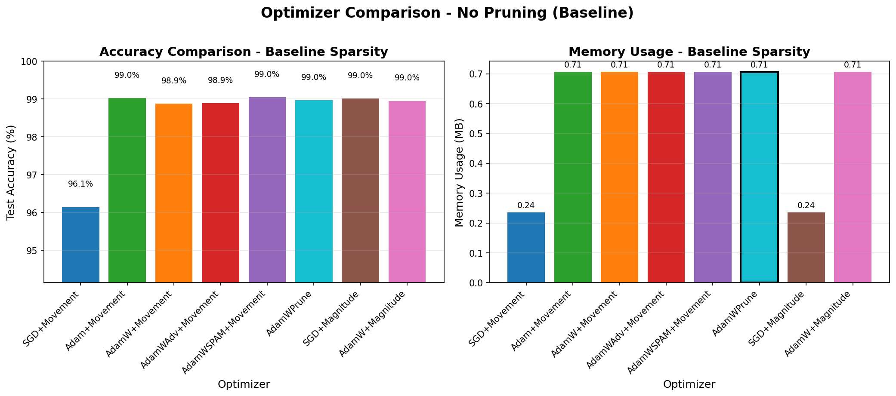
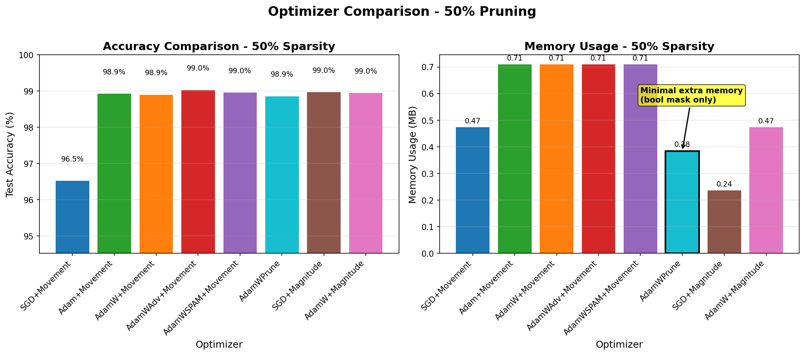
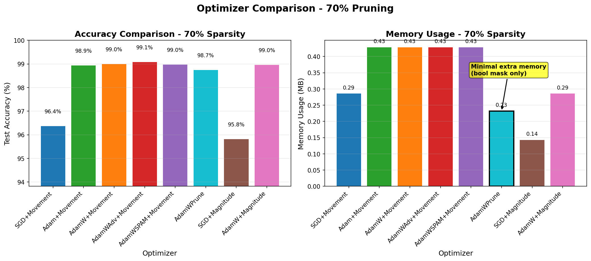
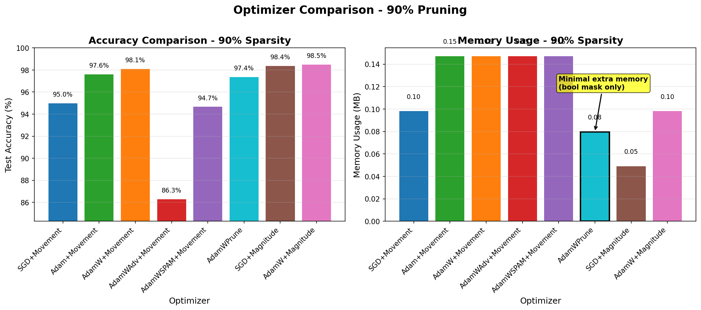
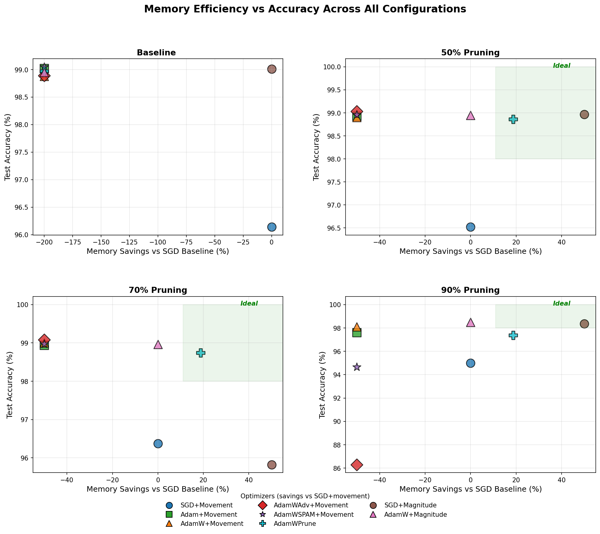
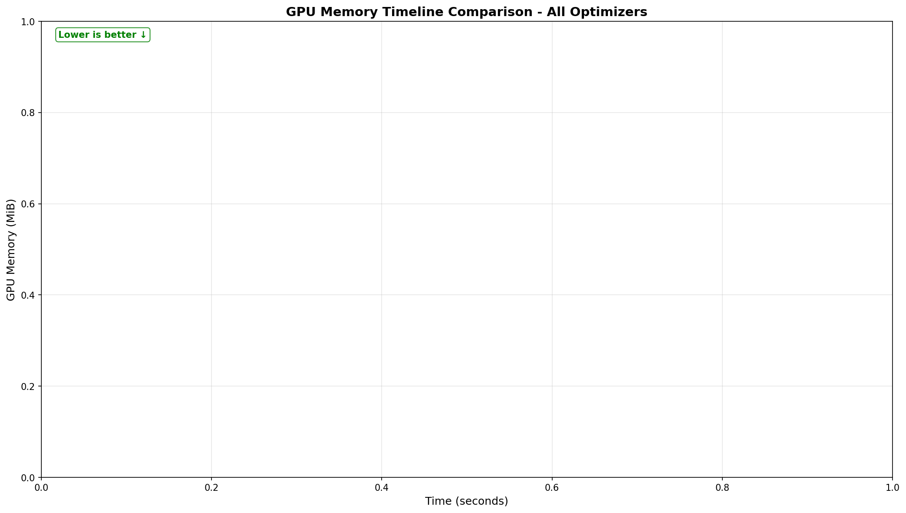

# LeNet-5 Findings

## Model Overview

LeNet-5 is a classic CNN architecture for MNIST digit classification with 61,750 parameters. This small model serves as our initial proof-of-concept for AdamWPrune's state-based pruning approach.

## Memory Overhead Analysis

Traditional movement pruning requires **extra memory** on top of optimizer states:
- **Importance scores**: 1 float per parameter to track weight importance
- **Binary masks**: 1 value per parameter to mark pruned/kept weights
- **Total overhead**: 1-2× model size in additional memory

**AdamWPrune's approach**: Reuses Adam's existing states for pruning decisions:
- `exp_avg` (momentum) → tracks weight importance
- `exp_avg_sq` (variance) → provides stability signals
- Requires only a boolean mask when pruning is enabled (1 byte/param)

### Memory Calculation (61,750 parameters, float32)
- Weights: ~247KB
- AdamW states: ~494KB (exp_avg + exp_avg_sq)
- Movement pruning buffers: ~741KB (scores + initial_weights + masks)
- AdamWPrune boolean mask: ~60KB

**Total memory at non-baseline sparsity levels:**
- **AdamW + movement pruning**: ~247KB + 494KB + 741KB ≈ 1,482KB
- **AdamWPrune**: ~247KB + 494KB + 60KB ≈ 801KB
- **Memory savings**: ~46% reduction in pruning overhead

## Performance Results

### Baseline (No Pruning)

*All optimizers achieve >99% accuracy on MNIST without pruning*

### 50% Sparsity

*AdamWPrune maintains competitive accuracy at 50% sparsity*

### 70% Sparsity

*Performance comparison at 70% sparsity target*

### 90% Sparsity

*High sparsity results - AdamWPrune shows resilience*

## Memory Efficiency Analysis

**Note**: The "Memory Savings" axis is computed relative to SGD using movement pruning at the same sparsity level. This highlights the incremental memory cost of different pruning approaches:
- Movement pruning maintains extra float32 buffers (scores + initial_weights + masks)
- AdamWPrune reuses Adam states and only adds a boolean mask
- Savings are relative to the pruning method, not unpruned baseline

## GPU Memory Comparison (Real Measurements)

### Actual GPU Memory Usage

With gputop.py integration, we now have real GPU memory measurements for LeNet-5:

*Real GPU memory measurements across all optimizers and pruning configurations*

*Memory usage over time during training - all optimizers cluster around 440-460 MiB*

### Key Findings from Real Measurements

**GPU Memory at 70% Sparsity:**
- SGD + Movement: ~442 MiB
- AdamW + Movement: ~452 MiB
- Adam + Movement: ~456 MiB
- AdamWPrune + State: ~461 MiB

**Why the minimal differences?**
1. **CUDA/PyTorch Overhead Dominates**: The baseline ~440-460 MiB is mostly framework overhead, not model-specific memory
2. **Model Too Small**: LeNet-5's 61K parameters are negligible compared to the framework's baseline memory allocation
3. **Memory Allocation Granularity**: PyTorch allocates memory in chunks, masking small differences
4. **Validation with ResNet-18**: This hypothesis is proven by ResNet-18 results, where the 180× larger model shows clear 7.5% memory savings with AdamWPrune

### Theoretical vs Actual

While theoretical calculations show ~46% reduction in pruning overhead buffers:
- **Theory**: AdamWPrune saves ~681KB vs movement pruning
- **Practice**: Differences are lost in the ~450 MiB CUDA baseline

This perfectly demonstrates why larger models like ResNet-18 are necessary to validate memory efficiency claims.

## Key Findings

1. **Accuracy Maintained**: AdamWPrune achieves comparable accuracy to movement pruning across all sparsity levels
2. **Memory Efficient**: ~46% reduction in pruning overhead by reusing optimizer states
3. **Scalability Potential**: While LeNet-5 is too small for runtime GPU memory measurements, the approach shows promise for larger models
4. **Simplicity**: No additional hyperparameters or buffers beyond a boolean mask

## Limitations

- LeNet-5's small size (61,750 parameters) makes GPU memory impact negligible
- MNIST is a relatively simple dataset where most approaches work well
- Further validation needed on larger models and complex datasets

## Next Steps

Testing with ResNet-18 on CIFAR-10 to validate the approach on a larger, more complex model and dataset combination.
