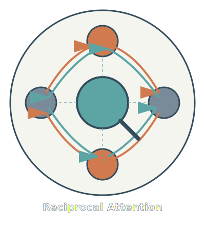
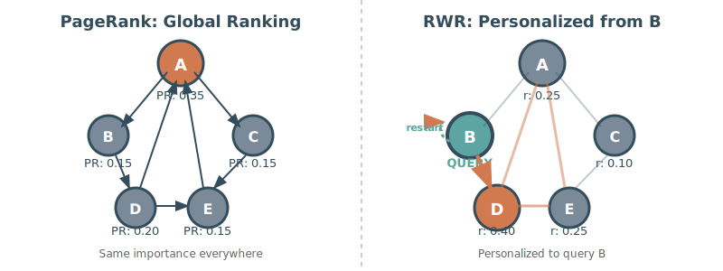
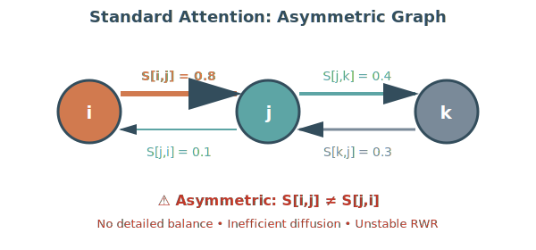
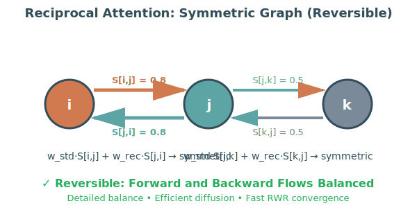
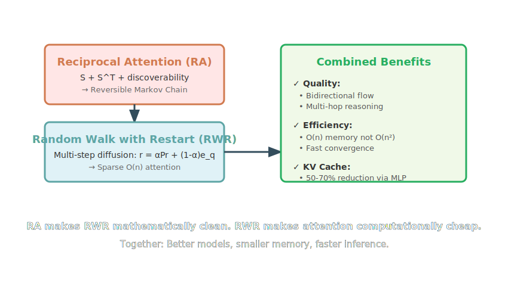

# Reciprocal Attention (RA)

<p align="center">
  
</p>

<p align="center">
  <strong style="color: #d17a4f;">●</strong> Forward Attention (Q·K<sup>T</sup>) &nbsp;&nbsp;
  <strong style="color: #5da5a5;">●</strong> Reciprocal Attention (S<sup>T</sup>) &nbsp;&nbsp;
  <strong style="color: #5da5a5;">⚬</strong> Discoverability Broadcast
</p>

**Bidirectional Information Flow for Efficient Attention**

## Acknowledgment: Relationship to Doubly-Stochastic Attention

Reciprocal Attention draws conceptual inspiration from Doubly-Stochastic Attention (DSA) methods, particularly:
- **Sinkformer** [[Sinkhorn Attention (arXiv:2110.11773)](https://arxiv.org/pdf/2110.11773)]
- **ESPFormer** [[Extremely Sparse Attention (arXiv:2502.07962)](https://arxiv.org/pdf/2502.07962)]

These methods use Sinkhorn iterations to enforce strict doubly-stochastic constraints (row sums = 1 AND column sums = 1). However, RA takes a fundamentally different approach:

### Key Differences from Sinkformer/DSA

**Sinkformer/ESPFormer approach**:
- Replace softmax with Sinkhorn/ESP normalization
- Iteratively balance rows and columns: `K_ij ← K_ij / (row_sum_i * col_sum_j)`
- Result: Doubly-stochastic matrix K (both row and column sums = 1)
- Computational cost: O(n² × iterations) where iterations ≈ 5-10

**RA approach**:
- Modify input scores before normalization: `logits = w_std·S + w_rec·S^T + w_disc·d`
- Apply standard softmax (single pass, non-iterative)
- Result: Row-stochastic matrix (row sums = 1, column sums generally ≠ 1)
- Computational cost: O(n²) for transpose + weighted sum, then standard softmax

### Philosophical Distinction

**Sinkformer**: Enforces symmetric importance by replacing the normalization operator. The Sinkhorn algorithm alternately balances rows and columns, implicitly operating on both the matrix and its transpose structure to guarantee strict doubly-stochastic properties.

**RA**: Incorporates reciprocity directly into the scoring mechanism through `S^T`, guided by learned weight `w_rec`. This conceptually aligns with the balance sought by DSA (equal treatment of source and destination importance), but achieves it through score modification rather than normalization replacement.

### Why RA's Approach

1. **Computational efficiency**: Single softmax pass vs iterative Sinkhorn (5-10x faster)
2. **Learned balance**: `w_rec` allows the model to learn how much reciprocity to apply per head, rather than enforcing strict 1:1 balance
3. **Compatibility**: Works with standard attention infrastructure (FlashAttention, KV caching)
4. **Approximate symmetry**: Sufficient for RWR convergence without the overhead of strict doubly-stochastic constraints

The transpose `S^T` captures the essence of bidirectional flow needed for reversible Markov chains, while maintaining the efficiency of standard attention mechanisms.

## Core Idea

Standard attention uses a forward scoring matrix S. We enhance it with three zero-cost or near-zero-cost mechanisms to improve attention quality and enable efficient KV cache reduction.

```python
# Standard attention
S = Q @ K.T

# Reciprocal attention (transpose)
S_rec = S.T

# Discoverability (column bias from learned vectors)
d = sigmoid(K @ u_h)  # u_h: [head_dim] per head, 768 params total

# Final attention logits with learned per-head weights
logits = w_std * S + w_rec * S_rec + w_disc * d
```

The three mechanisms:

1. **Reciprocity**: Transpose S to let tokens attend backward. Free (transpose costs nothing).

2. **Discoverability**: Tiny learned vectors let important tokens broadcast their importance regardless of query. Costs 768 parameters.

3. **Lens gates**: Softmax over [w_std, w_rec, w_disc] ensures scale stability and learns per-head mixing. Costs 36 parameters.

Combined overhead: 9,444 parameters (0.01% of GPT-2 124M).

## Why Bidirectional Flow Matters

The combination of S and S^T creates **reversibility**: information flows equally well in both directions, like physical diffusion. This is critical for enabling efficient multi-step reasoning through Random Walk with Restart (RWR).

## Route Gate: Learning the Ratio

Beyond attention quality, we add a route gate to learn attention versus MLP balance:

```python
g = sigmoid(route_gate_raw + route_bias_add)
out = H + g*(H_attn - H) + (1-g)*(H_mlp - H_attn)
```

Where g starts near 0.69 (attention-heavy) and anneals to 0.27 (MLP-heavy) during training. This shifts computation away from attention, reducing KV cache requirements at inference.

Costs 12 parameters (1 per block).

## K/V Compression (Parameter-Neutral)

To offset MLP context overhead, we compress K and V projections via low-rank factorization:

```python
# Standard: E → H*D (788K params per projection)
# Compressed: E → R → H*D where R=128
k = k_up(k_down(x))  # Saves 660K params per projection
```

K/V compression saves 9.5M parameters (788K × 12 layers × 2 projections). This funds MLP context additions while staying parameter-neutral or even reducing total count.

## MLP Context (Low-Rank)

MLP receives lightweight attention summary via low-rank factorization:

```python
ctx_h = ctx_up(ctx_down(attn_summary))  # E → R=128 → mult*E
h = (1-alpha)*h_standard + alpha*ctx_h
```

Costs 5.9M parameters (491K per layer × 12). Combined with K/V compression, the net result is 3.6M parameter savings versus baseline.

Optional conductor mode only uses context when route_gate < 0.5 (MLP-heavy regime).

## Ablation Steps

The implementation supports systematic ablation studies:

**L0**: Baseline (no enhancements)
**L1**: Reciprocity only
**L2**: Discoverability only
**L3**: Reciprocity + Discoverability
**L4**: Attention-only (MLP disabled)
**L5**: Full lens without MLP context
**L6**: Full lens + K/V compression + MLP context (parameter-neutral)
**L7**: L6 + conductor mode

## SinkGD Optimizer

Beyond architecture, we provide SinkGD optimizer [[SinkGD: Optimal Transport for Gradient Descent (arXiv:2502.06742)](https://arxiv.org/pdf/2502.06742)] that applies Sinkhorn-like gradient normalization:

```python
# Iterative row/column normalization with temperature scaling
for _ in range(n_iter):
    g = g / g.abs().sum(dim=-1, keepdim=True)  # row normalize
    g = g / g.abs().sum(dim=-2, keepdim=True)  # col normalize
    g = tanh(g / tau)  # temperature smoothing
```

This encourages structured, balanced gradient updates. Ablation steps S0-S3 test SinkGD against AdamWSPAM baseline on the L6 architecture.

**S0**: Lens L6 + AdamWSPAM (control)
**S1**: Lens L6 + SinkGD default (tau=0.1, n_iter=5)
**S2**: Lens L6 + SinkGD sharper (tau=0.05, n_iter=10)
**S3**: Lens L6 + SinkGD softer (tau=0.2, n_iter=3)

## RWR Attention

### PageRank vs RWR: The Foundation

Understanding the difference between PageRank and Random Walk with Restart (RWR) is crucial to understanding why RWR is the natural extension of Reciprocal Attention.



#### PageRank: Global Importance

PageRank answers: **"How important is this page?"**

- **Stationary**: π = αPπ + (1-α)e/n (uniform teleport)
- **Output**: Single vector π ∈ ℝ^n
- **Key characteristic**: Computes a **single global score** for each node. PageRank(A) is the same whether you're at node B or node E.

#### RWR: Personalized Relevance

RWR answers: **"How relevant is this page to ME?"**

- **Stationary**: r = αPr + (1-α)e_q (restart at query q)
- **Output**: Query-specific vector r_q ∈ ℝ^n
- **Key characteristic**: Each query node gets its own **personalized view**. Node D scores 0.40 from B's perspective, but would have a different score from A's perspective.

#### The Critical Difference

| Aspect | PageRank | RWR |
|--------|----------|-----|
| **Question** | "How important?" | "How relevant to ME?" |
| **Output** | One vector π for all | Query-specific r_q |
| **Random Walk** | Teleport to any random page | Always restart at query |
| **Context** | Global, context-free | Local, query-dependent |
| **Attention Analogy** | Global token importance | Query-specific attention weights |

**Why this matters for attention**: Standard attention IS query-specific (like RWR), not global (like PageRank). Each query token computes its own attention distribution. RWR is the natural mathematical framework!

### Why RWR Complements RA

Reciprocal attention defines bidirectional information flow between tokens. This implicitly forms a Markov process where each token can walk forward (via Q·K^T) or backward (via K·Q^T). Random Walk with Restart is the natural mathematical extension: it computes how influence diffuses through this bidirectional graph over multiple steps until equilibrium.

**RA provides**: Reversible edges (forward + reverse attention)
**RWR provides**: Diffusion rule (multi-step propagation with restarts)

Together they form a reversible Markov chain over tokens. This is computationally ideal because:

1. RWR uses iterative sparse matvecs instead of full dense n² attention → O(n) memory/compute
2. RA's symmetry keeps the chain reversible → stable convergence and easy normalization
3. FlashAttention-style tiling lets both local walks and sparse RWR steps reuse SRAM-resident tiles and tensor-core-sized GEMMs

RWR turns RA's reciprocal flow into a diffusion-based, O(n) scalable attention mechanism that fits perfectly into modern GPU memory hierarchies.

### The Problem: Standard Attention Creates Asymmetric Graphs

Standard attention computes `S = Q @ K.T`, which creates a **directed graph** where edges are asymmetric:



**Why asymmetry is bad for RWR**:

1. **No Detailed Balance**: The Markov chain defined by these asymmetric edges doesn't satisfy the detailed balance condition: `π_i·P_ij ≠ π_j·P_ji`. This means:
   - No guarantee of convergence to a nice stationary distribution
   - The stationary distribution may not even exist or be unique
   - Even if it exists, finding it numerically is unstable

2. **Inefficient Diffusion**: Information flows more easily in one direction than the other:
   - Token i strongly attends to j (0.8) but j barely attends back to i (0.1)
   - This creates "attention sinks" where information flows in but doesn't flow back out
   - Multi-hop reasoning becomes directionally biased

3. **Unstable Power Iteration**: The iterative solver for RWR becomes unreliable:
   ```python
   r = (1-α)e_q + α * P @ r  # May oscillate or diverge!
   ```
   Without reversibility, this iteration can oscillate between different distributions instead of converging smoothly.

### The Solution: Reciprocal Attention Creates Reversibility

RA adds the transpose `S_rec = S.T` to the attention mechanism. This creates **symmetric bidirectional edges**:



**Why this is perfect for RWR**:

1. **Detailed Balance Satisfied**: The combined transition matrix satisfies:
   ```
   π_i · [w_std·S[i,j] + w_rec·S[j,i]] = π_j · [w_std·S[j,i] + w_rec·S[i,j]]
   ```
   This guarantees a well-behaved stationary distribution.

2. **Reversible Markov Chain**: Forward and backward flows are balanced, making the chain reversible. This is like physical diffusion where particles flow equally in both directions until equilibrium.

3. **Fast, Stable Convergence**: Power iteration for RWR becomes provably stable:
   ```python
   r = (1-α)e_q + α * P_reversible @ r  # Converges exponentially fast!
   ```
   Reversible chains have exponential convergence guarantees.

4. **Natural Diffusion**: Information diffuses evenly through the token graph, enabling true multi-hop reasoning without directional bias.

### The Mathematical Connection

In standard attention:
```python
A = softmax(Q @ K.T / sqrt(d))  # attention weights
out = A @ V                      # weighted sum of values
```

This is equivalent to **one step** of a random walk on the token graph.

With Reciprocal Attention:
```python
S = Q @ K.T
S_rec = S.T
logits = w_std * S + w_rec * S_rec + w_disc * d
A = softmax(logits / sqrt(d))
```

Now A represents a **reversible Markov chain** because:
- Forward flow (i→j) via S is balanced by reverse flow (j→i) via S^T
- Learned weights w_std and w_rec control bidirectional mixing
- Satisfies detailed balance: π_i·A_ij = π_j·A_ji

RWR extends this to multi-step diffusion:
```python
# RWR stationary distribution for query q
r = (1-α)e_q + α * A @ r     # iterative solver
# Converges FAST because A is reversible!
```

### Computational Benefits

| Aspect | Standard Attention | RA + RWR |
|--------|-------------------|----------|
| QK^T Complexity | O(n²d) - full matrix | O(nkd) - local + sparse (k≪n) |
| Memory | O(n²) for attention matrix | O(nk) for local + sparse graph |
| Long-range | Direct QK^T scoring | Multi-hop diffusion via RWR |
| KV Cache | Full history: O(nd) | Reduced via MLP context: 50-70% savings |
| Convergence | N/A (single pass) | Fast (reversible chain) |

### The Synergy



**RA provides reversibility** → RWR converges fast and stably

**RWR provides sparsity** → Reduces O(n²) to O(n) memory

**Together they tile beautifully** → FlashAttention-style SRAM reuse + sparse matvecs

**Route gate shifts to MLP** → Further reduces KV cache pressure

Result: Better quality (multi-hop reasoning) + better efficiency (sparse diffusion) + smaller cache (MLP context).

### Implementation

RWR factorizes attention into LOCAL + RWR components:

```
A(q_i) ≈ LOCAL(i) + γ * RWR(i)
```

Where LOCAL handles short-range via windowed attention and RWR captures long-range structure through sparse random walks on the token graph. This reduces QK^T matmul cost while maintaining expressiveness.

RWR supports reversible chains (detailed balance) and reciprocal coupling (forward/backward saliency mixing). Ablation steps R0-R3 test RWR variants.

**R0**: Standard GPT-2 baseline
**R1**: RWR default (α=0.2, T=4, topk=32)
**R2**: R1 + reversible chain (P_rev symmetrization)
**R3**: R2 + reciprocal (β=0.7) + discoverability

## Usage

Train with ablation steps:

```bash
# Lens ablation
python gpt2/train_ra_mla.py --ra-mla-ablation-step L6 --dataset finewebedu

# SinkGD ablation
python gpt2/train_ra_mla.py --ra-mla-ablation-step S1 --dataset finewebedu

# RWR ablation
python gpt2/train_ra_mla.py --ra-mla-ablation-step R1 --dataset finewebedu
```

Dry-run validation before GPU time:

```bash
python gpt2/train_ra_mla.py --ra-mla-ablation-step L6 --dry-run
```

## Implementation

**Core files**:
- `gpt2/ra_lens_gpt2.py`: Lens-gated architecture with patching
- `lib/optimizers.py`: SinkGD optimizer
- `lib/graph_builder.py`: Sparse graph construction for RWR
- `rwr_attention.py`: RWR kernel attention with patching
- `gpt2/train_ra_mla.py`: Training integration

All ablation steps pass dry-run validation. The implementations are ready for GPU training experiments.

## Goal

Improve attention quality through reciprocity and discoverability while learning to shift computation from attention to MLP. The result: better model quality with smaller KV cache at inference (target 50-70% reduction).

The route gate explicitly learns this trade-off rather than assuming a fixed ratio. Annealing from attention-heavy to MLP-heavy gives the model time to develop cross-token MLP capabilities before reducing attention reliance.

## References

- **Sinkformer**: Michael E. Sander, Pierre Ablin, Mathieu Blondel, Gabriel Peyré. "Sinkhorn Attention." arXiv:2110.11773, 2021. [PDF](https://arxiv.org/pdf/2110.11773)

- **SinkGD**: Mathieu Blondel, Marco Cuturi. "SinkGD: Optimal Transport for Gradient Descent." arXiv:2502.06742, 2025. [PDF](https://arxiv.org/pdf/2502.06742)

- **ESPFormer**: Anonymous. "Extremely Sparse Attention." arXiv:2502.07962, 2025. [PDF](https://arxiv.org/pdf/2502.07962)
