# Test Matrix Results: test_matrix_results_20250903_180836

*Generated: 2025-09-03 23:12:40*

## Overview

- **Total Tests**: 5

## Visualization Graphs

### Adam Accuracy Evolution
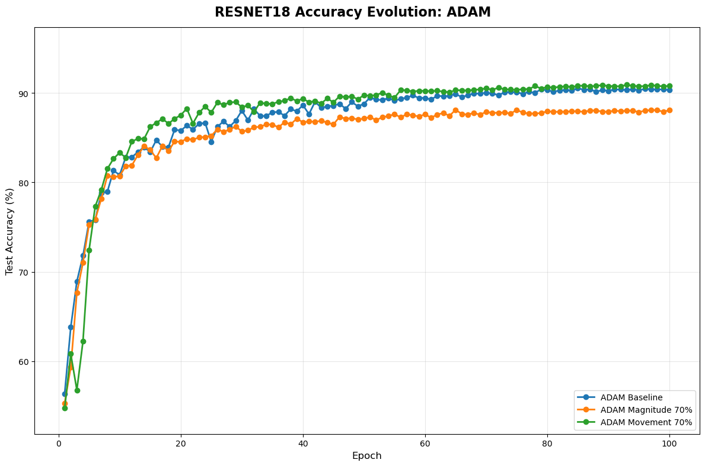

### Adam Model Comparison
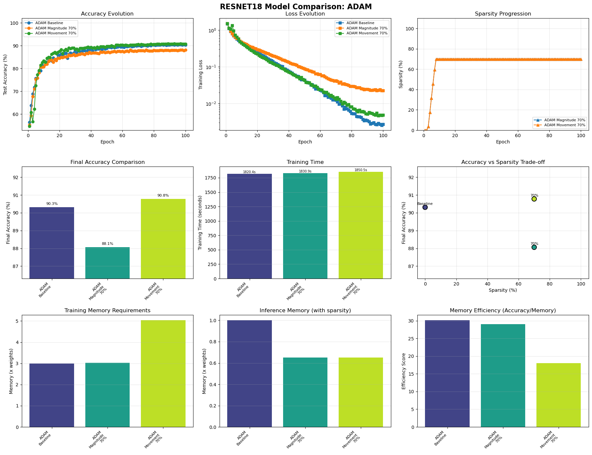

### Adamwprune Accuracy Evolution
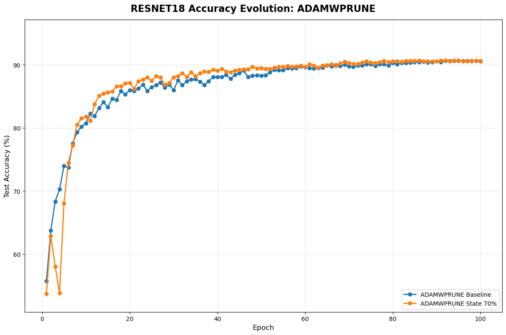

### Adamwprune Model Comparison
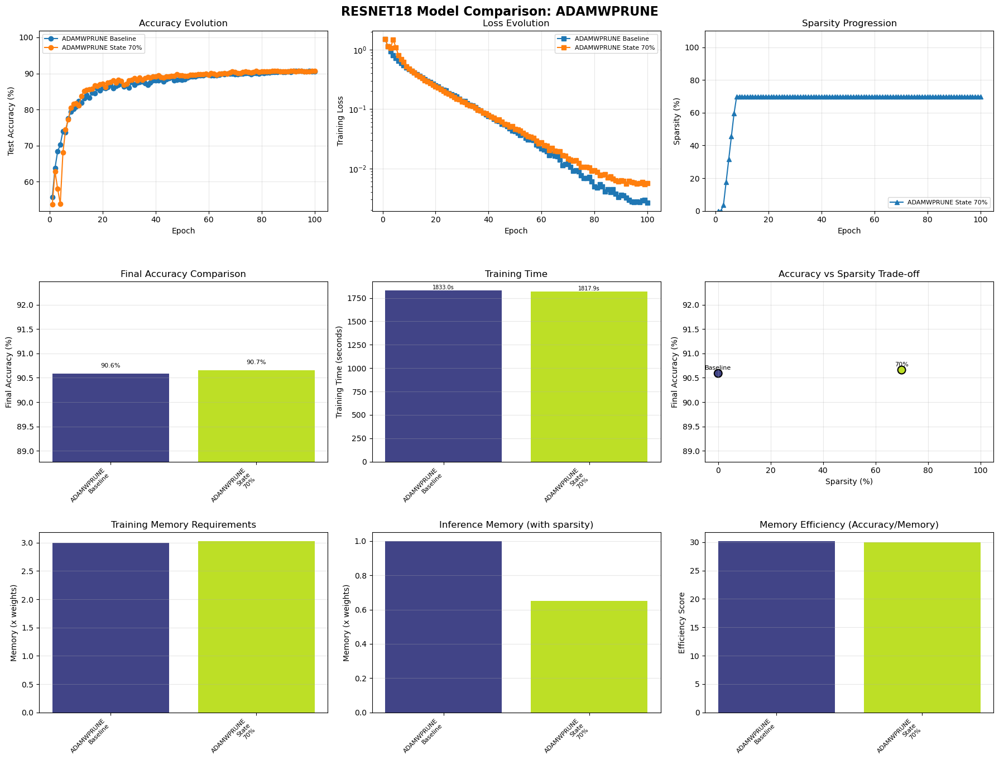

### Gpu Memory Comparison
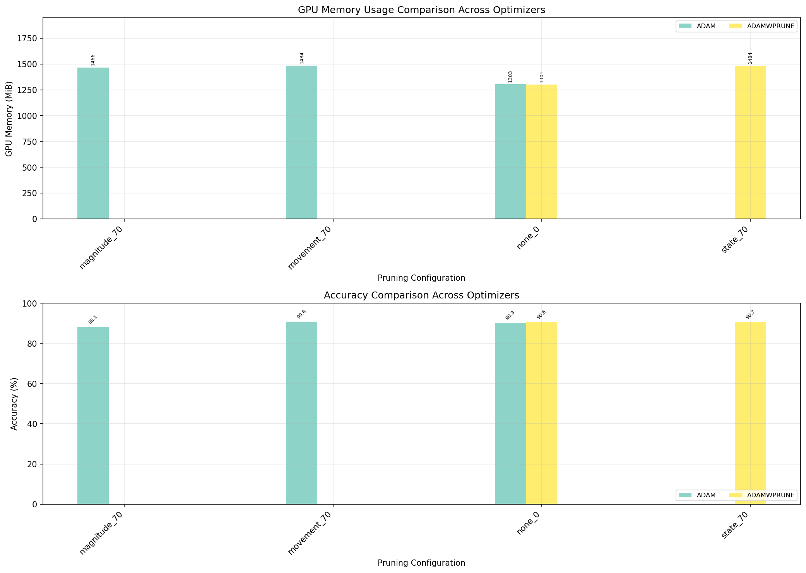

### Gpu Memory Timeline
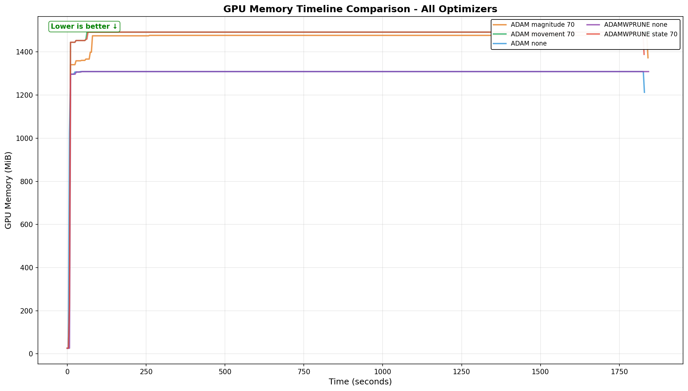

### Memory Vs Accuracy Scatter
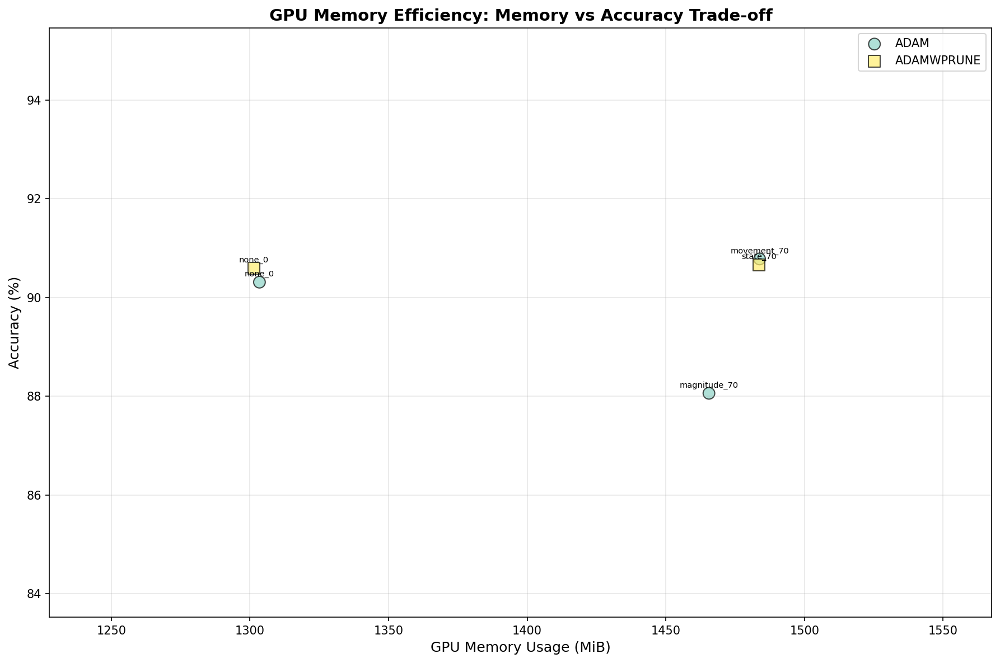

### Training Memory Comparison
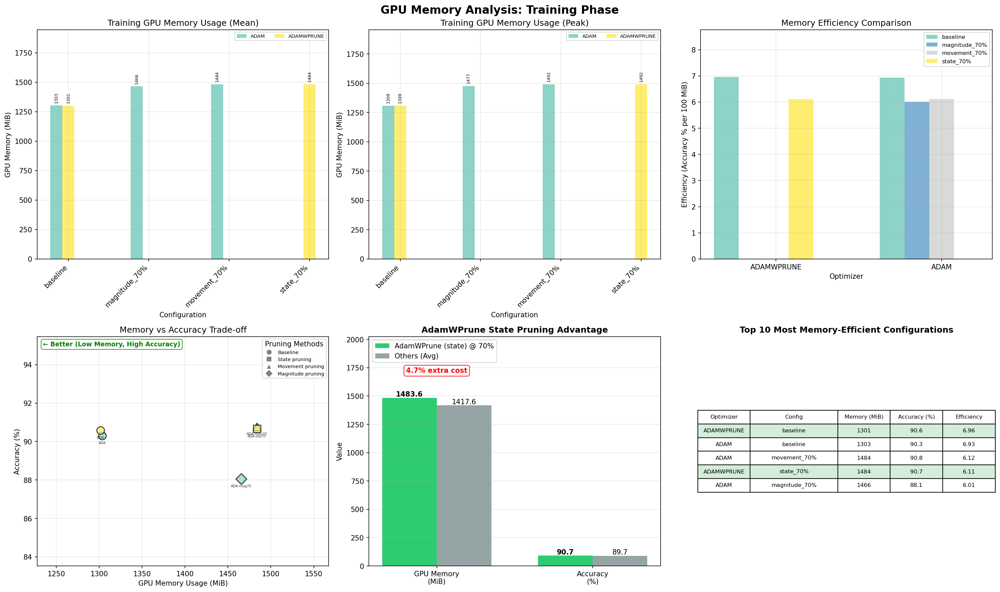

## Detailed Test Results

| Test Configuration | Accuracy | Sparsity | GPU Mean | GPU Max | Training Time |
|-------------------|----------|----------|----------|---------|---------------|
| resnet18_adam_magnitude_70 | 88.06% | 70 | N/A | N/A | N/A |
| resnet18_adam_movement_70 | 90.78% | 70 | N/A | N/A | N/A |
| resnet18_adam_none | 90.31% | 0 | N/A | N/A | N/A |
| resnet18_adamwprune_none | 90.59% | 0 | N/A | N/A | N/A |
| resnet18_adamwprune_state_70 | 90.66% | 70 | N/A | N/A | N/A |

## Individual Training Plots

### resnet18_adam_magnitude_70
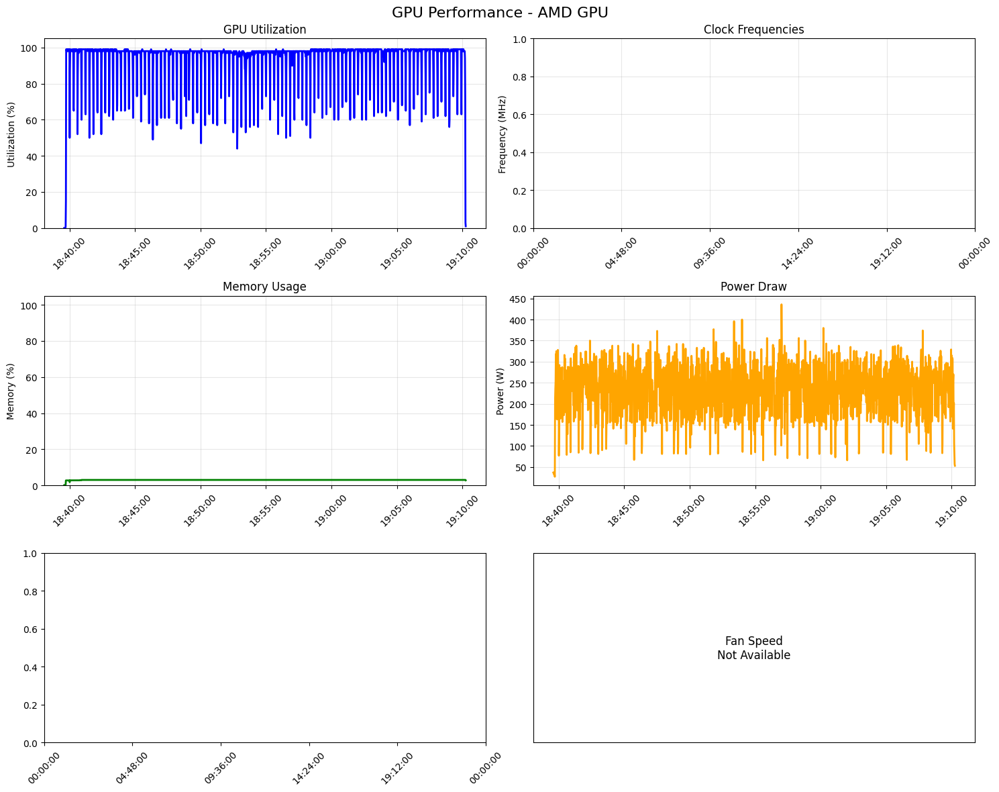

### resnet18_adam_movement_70
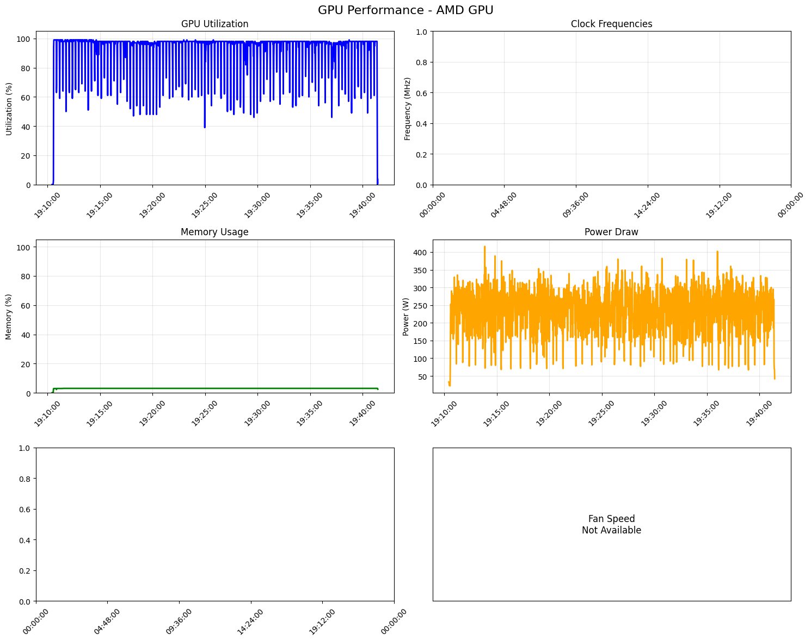

### resnet18_adam_none
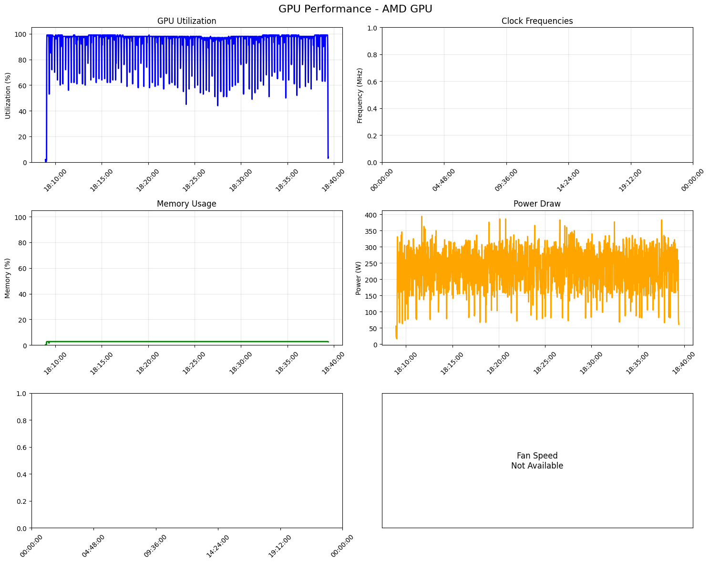

### resnet18_adamwprune_none
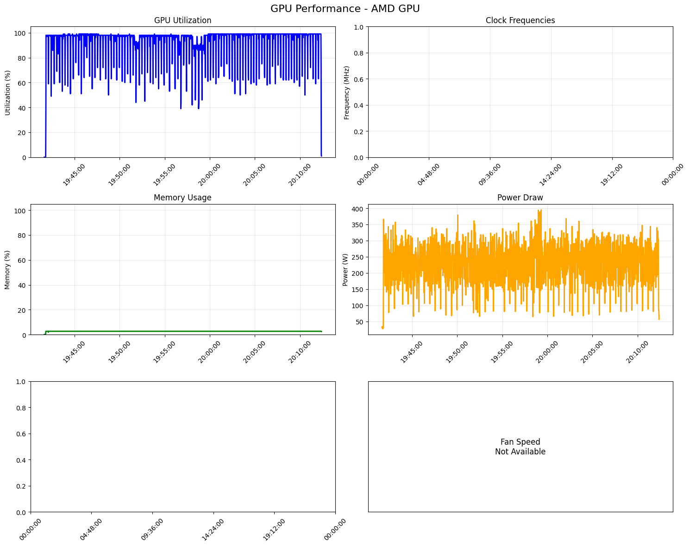

### resnet18_adamwprune_state_70
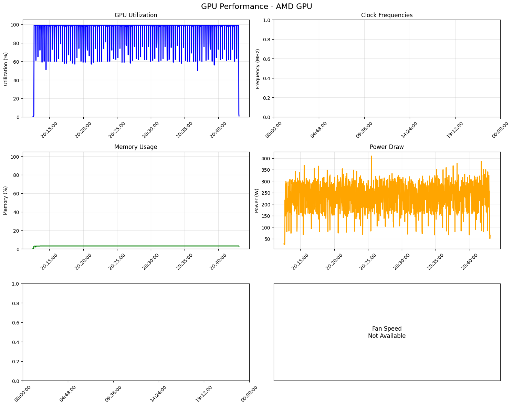

## Summary Report

```
Test Matrix Summary Report (With Real GPU Memory Data)
Generated: 2025-09-03T20:43:14.299660
From: test_matrix_results_20250903_180836
================================================================================

Total tests: 5
Successful: 5
Failed: 0

Results Table:
---------------------------------------------------------------------------------------------------------
Test ID                                  Accuracy Sparsity GPU Mean (MiB) GPU Max (MiB) Status    
---------------------------------------------------------------------------------------------------------
resnet18_adam_movement_70                 90.7800   0.7000         1486.2        1524.0 ✓ Success 
resnet18_adamwprune_state_70              90.6600   0.7000         1337.1        1356.0 ✓ Success 
resnet18_adamwprune_none_0                90.5900   0.0000         3664.2        4107.0 ✓ Success 
resnet18_adam_none_0                      90.3100   0.0000            N/A           N/A ✓ Success 
resnet18_adam_magnitude_70                88.0600   0.7000         1419.5        1445.0 ✓ Success 
---------------------------------------------------------------------------------------------------------

Best Performers:
--------------------------------------------------------------------------------
Top Results by Accuracy:
1. resnet18_adam_movement_70: 90.7800 (GPU: 1486.2 MB)
2. resnet18_adamwprune_state_70: 90.6600 (GPU: 1337.1 MB)
3. resnet18_adamwprune_none_0: 90.5900 (GPU: 3664.2 MB)
4. resnet18_adam_none_0: 90.3100
5. resnet18_adam_magnitude_70: 88.0600 (GPU: 1419.5 MB)

Best by Optimizer:
  adam: resnet18_adam_movement_70 (90.7800, GPU: 1486.2 MB)
  adamwprune: resnet18_adamwprune_state_70 (90.6600, GPU: 1337.1 MB)

GPU Memory Efficiency Analysis (Real Measurements):
--------------------------------------------------------------------------------
Most Memory-Efficient (Accuracy per 100MB GPU):
1. resnet18_adamwprune_state_70
   Accuracy: 90.66%, GPU Memory: 1337.1 MB, Efficiency Score: 6.78
2. resnet18_adam_magnitude_70
   Accuracy: 88.06%, GPU Memory: 1419.5 MB, Efficiency Score: 6.20
3. resnet18_adam_movement_70
   Accuracy: 90.78%, GPU Memory: 1486.2 MB, Efficiency Score: 6.11
4. resnet18_adamwprune_none_0
   Accuracy: 90.59%, GPU Memory: 3664.2 MB, Efficiency Score: 2.47

Lowest GPU Memory Usage:
1. resnet18_adamwprune_state_70
   GPU Memory: 1337.1 MB (max: 1356.0 MB), Accuracy: 90.66%
2. resnet18_adam_magnitude_70
   GPU Memory: 1419.5 MB (max: 1445.0 MB), Accuracy: 88.06%
3. resnet18_adam_movement_70
   GPU Memory: 1486.2 MB (max: 1524.0 MB), Accuracy: 90.78%
4. resnet18_adamwprune_none_0
   GPU Memory: 3664.2 MB (max: 4107.0 MB), Accuracy: 90.59%

AdamWPrune Performance (Real GPU Measurements):
--------------------------------------------------------------------------------
Configuration: resnet18_adamwprune_state_70
  Accuracy: 90.66%
  Sparsity achieved: 70.0%
  GPU Memory (mean): 1337.1 MB
  GPU Memory (peak): 1356.0 MB
  Memory savings vs others: 115.8 MB (8.0%)
Configuration: resnet18_adamwprune_none_0
  Accuracy: 90.59%
  Sparsity achieved: 0.0%
  GPU Memory (mean): 3664.2 MB
  GPU Memory (peak): 4107.0 MB
  Memory savings vs others: -2211.4 MB (-152.2%)

GPU Memory Comparison (All Optimizers):
  adam        :  1452.8 MB (avg of 2 runs)
  adamwprune  :  2500.6 MB (avg of 2 runs)

```

## Key Findings

- **Best Accuracy**: 90.31% (resnet18_adam_none)
